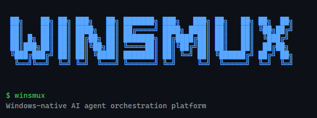

[English](README.md) | [日本語](README.ja.md)

<p align="center">
  
</p>

# winsmux

**winsmux は、Windows ネイティブでローカル完結型のマルチエージェント統制基盤です。**

1 人のオペレーターが、Windows 上で動く複数の AI エージェント CLI を束ねて運用するためのランタイムと制御レイヤーを提供します。特定のベンダーに依存せず、ペインの実行、比較、ライブ監視、レビューを同じワークスペース内で扱えます。

`v0.21.2` は、デスクトップ移行前のターミナル中心の最終リリースです。Windows ネイティブのターミナル画面、外部オペレーター方式、管理対象ワーカーペイン、証跡とレビューの統制をここで一度固めます。`v0.22.0` からは Tauri デスクトップへの引き継ぎが始まり、`v0.24.0` では将来のデスクトップ / バックエンド形に向けた Rust 契約整備が始まります。

## winsmux が提供するもの

- **マルチベンダー対応**: Codex、Claude、Gemini など複数の CLI エージェントを同じセッションで並行運用
- **リアルタイム監視**: 事後要約ではなく、`winsmux` のペインを通じて各エージェントの状態をライブで確認
- **統制された実行基盤**: 外部オペレーターと管理対象エージェントの権限を分け、レビューと証跡の導線を組み込み

```powershell
winsmux read worker-1 20
winsmux send worker-2 "最新の auth 変更をレビューしてください。"
winsmux health-check
```

## 認証方針

winsmux は、複数の CLI エージェントを安全に運用するための統制基盤です。  
そのため、winsmux 自身が OAuth ログインを代行したり、認証情報を中継したりする設計は採りません。

- 対応状況は、ツールごとではなく **認証方式ごと** に分けて扱います
- winsmux 自身は OAuth ログインを代行しません
- CLI 自体にその認証方式があっても、その認証方式を winsmux が正式に支えるとは限りません

| ツール | 認証方式 | winsmux での扱い |
| ------- | ------- | ------- |
| Claude Code | API key / 公式の企業向け認証 | 正式サポート |
| Claude Code | Pro / Max OAuth | サポート対象外 |
| Codex CLI | API key | 正式サポート |
| Codex CLI | ChatGPT OAuth | 当該 PC での対話利用のみ |
| Gemini CLI | Gemini API key | 正式サポート |
| Gemini CLI | Vertex AI | 正式サポート |
| Gemini CLI | Google OAuth | サポート対象外 |

### 用語補足

- **正式サポート**  
  winsmux の標準の使い方として案内する認証方式です。起動、比較、複数エージェント運用で使えます。

- **当該 PC での対話利用のみ**  
  その CLI 自身が、その PC 上で公式のログイン手順を完了した状態に限って使えます。  
  winsmux 自身がログインを代行したり、認証情報を取り出したり、他のペインや他のユーザーに共有したりはしません。

- **サポート対象外**  
  winsmux の標準の使い方としては案内しない認証方式です。起動前の確認で止める対象です。

認証方針の詳細は [docs/authentication-support.ja.md](docs/authentication-support.ja.md) を参照してください。

## winsmux が向いている場面

多くのエージェントツールは、単一ベンダー・単一実行モデルに最適化されています。winsmux は、Windows で複数エージェントを同時に動かしつつ、全体を観測可能かつ統制可能に保ちたいチーム向けに設計されています。

- **ベンダー非依存の複数エージェント運用**: 1 つのオペレーターの下で Codex、Claude、Gemini、将来のローカルモデルを混在運用
- **ペインを直接扱う運用**: `winsmux` を通じて、ライブのペインを確認し、中断し、切り替え、名前を付け直せる
- **統制された実行**: 実行前に読む運用、レビュー可能なスロット、ワーカーワークツリー分離を組み合わせて事故を減らす
- **Windows-first**: WSL2 や Linux 経由を前提にしない

## プラットフォームモデル

```text
winsmux
├── winsmux CLI
├── Orchestra
├── Role Gates
├── Worker Worktree Isolation
├── Credential Vault (DPAPI)
└── Evidence Ledger
```

- **`winsmux`** はペインの指定、メッセージ送信、状態確認、資格情報の注入、オペレーターによる制御を担います
- **Orchestra** は、1 人の外部オペレーターが複数の管理対象エージェントを統制する構成を標準とします
- **Role gates** はオペレーターと管理対象エージェントの実行権限を分離します
- **Worker worktree isolation** は、ワーカーごとに独立した git ワークツリーを与えます
- **Evidence Ledger** はレビューや監査向けの証跡を扱います

公開向けのオペレーター / ペイン構成は [docs/operator-model.md](docs/operator-model.md) を参照してください。repository 運用専用のペイン / ランタイム契約は contributor 向け資料に残しますが、主要な公開導線には含めません。

## コアランタイム

オーケストレーション層の下には、Rust 製の Windows ネイティブなターミナル多重化ランタイムがあります。

- **tmux 互換ランタイム**: tmux 互換のコマンド体系を備え、`~/.tmux.conf` や既存テーマを利用可能
- **Windows ネイティブ操作性**: ConPTY ベース、マウス対応、WSL/Cygwin/MSYS2 依存なし
- **複数エントリポイント**: `winsmux`、`pmux`、`tmux`
- **自動化向け**: 76 個の tmux 互換コマンドと 126+ の書式変数

| ランタイム資料 | 内容 |
| ------- | ------- |
| [Features](core/docs/features.md) | マウス、copy mode、レイアウト、書式、スクリプト操作面 |
| [Compatibility](core/docs/compatibility.md) | tmux 互換マトリクスとコマンド実装状況 |
| [Configuration](core/docs/configuration.md) | 設定ファイル、option、environment variable、`.tmux.conf` 対応 |
| [Key Bindings](core/docs/keybindings.md) | 既定のキーボード操作とマウス操作 |
| [Mouse over SSH](core/docs/mouse-ssh.md) | SSH 越しのマウス動作と Windows 版要件 |
| [Claude Code](core/docs/claude-code.md) | teammate pane がランタイム上でどう動くか |

## インストール

### 現在利用できる導入方法

```powershell
irm https://raw.githubusercontent.com/Sora-bluesky/winsmux/main/install.ps1 | iex
```

インストーラーは次を行います。

- `winsmux` ランタイムが未インストールなら導入
- `winsmux` wrapper script を `~\.winsmux\bin` に配置
- `.winsmux.conf` を構成
- Windows Terminal に **winsmux Orchestra** profile を登録

tmux 互換ランタイムだけが必要なら、直接インストールも可能です。

```powershell
winget install winsmux
cargo install winsmux
scoop bucket add winsmux https://github.com/winsmux/scoop-winsmux
scoop install winsmux
choco install winsmux
```

GitHub Releases の `.zip` を使うか、[`core/`](core) でソースからビルドすることもできます。

### 今後の導入方法（予定）

- `winsmux init` と `winsmux launch` は、初回利用向けの公開コマンドです
- `winsmux launcher presets [--json]` は、起動プリセットとペアテンプレートを確認する公開コマンドです
- `winsmux launcher lifecycle [preset|--clear] [--json]` は、現在のワークスペース方針を選ぶ公開コマンドです
- `winsmux launcher save <name>` は、現在の起動テンプレートを保存する公開コマンドです
- `winsmux conflict-preflight` は、compare UI が入る前の公開向け coordination guard として使えます
- `winsmux compare <runs|preflight|promote>` は、比較と後続候補作成の公開コマンドです
- `npm install` による導入も予定しています
- 公開向けの npm install は **単一の `winsmux` package** を前提に設計します
- 将来の公開コマンドは `npm install -g winsmux` を想定しています
- 計画している npm 契約は **Windows 専用** とします
- 計画している npm コマンドは `winsmux install`、`winsmux update`、`winsmux uninstall`、`winsmux version`、`winsmux help` です
- npm package の version は、同じ GitHub Release tag を指す `install.ps1` に揃えます
- staged package の Windows 検証と tag 起点の release workflow が揃うまで、npm publish は開けません
- 現在の `winsmux-mcp` や非公開の `winsmux-app` build は、そのまま公開向けの npm パッケージには使いません
- `winsmux` の npm package 名は確保済みですが、repository からの自動公開は public installer 契約が固まるまで止めています

導入予定のインストールプロファイルは以下の 4 種類です。

| プロファイル | 内容 |
| ------- | ------- |
| `core` | ランタイム、ラッパースクリプト、`PATH` 設定、基本設定 |
| `orchestra` | `core` に加えて、`orchestra` 向けスクリプトと Windows Terminal のプロファイル |
| `security` | `core` に加えて、秘匿情報保管、機密マスキング、監査向けスクリプト |
| `full` | `core`、`orchestra`、`security` をまとめた既定プロファイル |

将来の npm コマンドでもパッケージ名は 1 つに保ちます。
プロファイル名は同梱のインストーラーに引数として渡します。

例:

```powershell
winsmux install --profile full
```

`winsmux update` に新しいプロファイルを渡さない場合は、前回記録したプロファイルを使います。
記録先は `~\.winsmux\install-profile` です。
インストーラーは、指定したプロファイルに応じて導入対象を切り分けます。
たとえば `core` では、`orchestra` 向けスクリプト、`vault` 機能、Windows Terminal の設定プロファイルを含めません。
後からプロファイルを変更した場合、インストーラーは対象外になった支援スクリプトを削除します。
Windows Terminal の設定プロファイルも、選択したプロファイルに応じて追加または削除します。

## クイックスタート

現在公開しているクイックスタートは、`winsmux init` と `winsmux launch` を起点にする手順です。
`winsmux compare` は、比較と後続候補作成の公開コマンドです。
`/winsmux-start` は Claude Code による dogfooding 専用フローとして扱います。

```powershell
# 既定の first-run 設定を作成
winsmux init

# 必要ならワークスペース方針を指定
winsmux init --workspace-lifecycle managed-worktree

# 確認を通し、既定の Orchestra レイアウトを起動
winsmux launch
```

`winsmux init` は、現在のプロジェクト向けに既定の `.winsmux.yaml` を作ります。
`winsmux launch` は、これまでの `doctor -> orchestra-start` の流れを 1 つの公開コマンドへまとめます。
`winsmux launcher presets [--json]` は、利用できるスロット能力に合う起動プリセットを確認します。
比較向けのペアテンプレートも表示します。
`winsmux launcher save <name>` と `winsmux launcher list` は、再利用する起動テンプレートを `.winsmux` ディレクトリに保存します。
`winsmux launcher lifecycle ephemeral-worktree` は、`.winsmux.yaml` を書き換えずにローカルの上書き設定を保存します。
ライフサイクルプリセットは、宣言的な方針だけを扱います。
プロジェクト設定から任意の準備スクリプトや片付けスクリプトを実行しません。
`winsmux compare runs <left_run_id> <right_run_id>` は、2 つの記録済み実行を比較します。
`winsmux compare preflight <left_ref> <right_ref>` は、マージ前や比較レビュー前に参照を確認します。
`winsmux compare promote <run_id>` は、成功した実行から再利用する後続候補を作ります。
`winsmux conflict-preflight <left_ref> <right_ref>` は、互換コマンドとして残します。

Windows で `winsmux doctor` がワークツリーの sandbox 制限を報告した場合は、サンドボックス内のペインでファイル編集やテストを続けつつ、`.git/worktrees/*/index.lock` を作れない場合の `git add`、`git commit`、`git push` だけを通常のシェルから実行してください。

Windows の `ConstrainedLanguageMode` を含む詳細な回避策は [docs/TROUBLESHOOTING.md](docs/TROUBLESHOOTING.md) を参照してください。

現在の既定レイアウトは次です。

- 管理対象ウィンドウの外に外部オペレーター用ターミナル
- 管理対象ウィンドウの中に複数の `worker-*` ペイン
- 旧 `Operator / Builder / Researcher / Reviewer` レイアウトは互換モードでのみ有効

デスクトップ側のロードマップは、次の 3 つの UX レイヤーに再整理しています。

- **Decision Cockpit**: 実行結果を見て、比べて、選ぶための画面群
- **Fast Start + Launcher + Coordination Guard**: 初回セットアップを短くし、複数エージェント起動と競合予防をまとめる画面群
- **Managed Team Intelligence**: 永続メモリ、フォローアップ手順、多様性戦略を扱う上位レイヤー

この版が、ターミナルを主要な制御面として使う最後のリリース系列です。次の `v0.22.0` ではターミナルランタイムを維持しつつ、デスクトップ統制の主軸を Tauri 側へ移します。

セッション内では、ペインを一覧表示し、読み取り、送信できます。

```powershell
winsmux list
winsmux read worker-1 30
winsmux send worker-3 "upstream issue を要約してください。"
```

## ガバナンスの要点

- **Role gates**: 外部オペレーターと管理対象エージェントに同じコマンド操作面を与えない
- **Read Guard**: 読んでいないペインへの盲目的な入力を防ぐ
- **Worktree isolation**: ワーカーごとに独立した git ワークツリーを持てる
- **Credential Vault**: Windows DPAPI でシークレットを管理し、repo に `.env` を置かない
- **Evidence Ledger**: プロンプト、操作、レビュー証跡を記録できる
- **証拠を先に扱う検証**: `cargo fmt --check`、`cargo clippy -- -D warnings`、`cargo test`、`cargo audit` のような代表コマンドは、単なる感想ではなく、再利用できるレビュー証拠として扱う
- **最終判断はオペレーターが持つ**: レビュー可能なペインは指摘と証拠を返しますが、受け入れ可否の最終判断は外部オペレーターが持つ

## 主要コマンド

| コマンド | 用途 |
| ------- | ------- |
| `winsmux list` | ペイン、ラベル、プロセスを表示 |
| `winsmux read <target> [lines]` | 実行前にペインの出力を読む |
| `winsmux send <target> <text>` | テキストを送信して Enter を押す |
| `winsmux health-check` | ラベル付きペインの READY/BUSY/HUNG/DEAD を報告 |
| `winsmux launcher <presets|lifecycle|list|save>` | 起動プリセット、ワークスペース方針、保存済みテンプレートを扱う |
| `winsmux compare <runs|preflight|promote>` | 実行比較、参照確認、後続候補作成を行う |
| `winsmux vault set <key> [value]` | DPAPI で保護された保管庫に資格情報を保存 |
| `winsmux vault inject <pane>` | 保存済み資格情報を対象ペインに注入 |
| `winsmux update` | 最新版へ更新 |
| `winsmux uninstall` | winsmux を削除 |

## 動作要件

- Windows 10/11
- PowerShell 7+
- Windows Terminal 推奨

## ライセンス

Apache License 2.0
