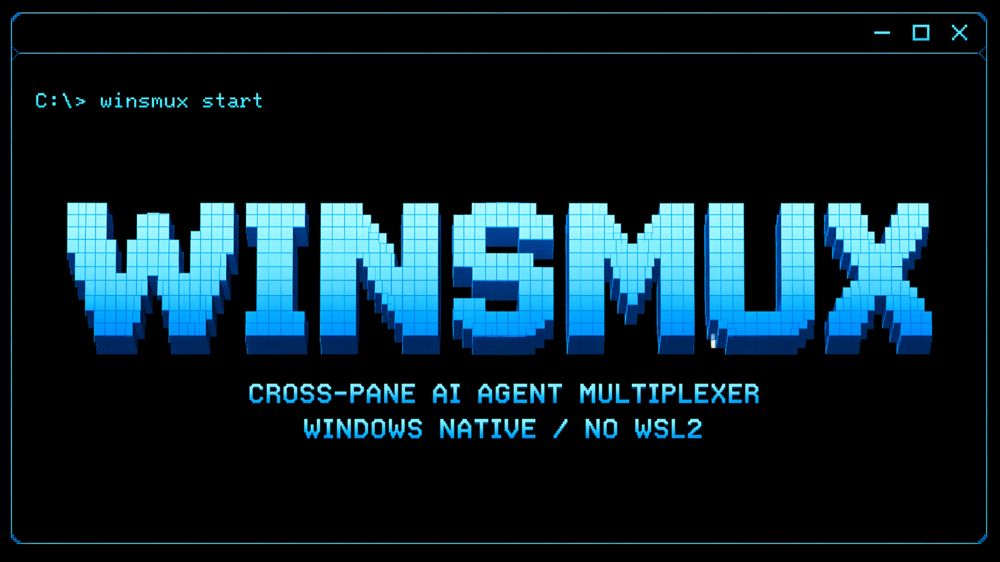

[English](README.md) | [日本語](README.ja.md)

<p align="center">
  
</p>

# winsmux

`winsmux` helps one human operator run and supervise several CLI agents on Windows.

You keep local control. `winsmux` starts the panes, lets you read what each agent is doing, sends instructions to the right pane, compares results, and keeps enough evidence for review.

`winsmux` does not sign in to AI services for you. Each agent CLI keeps using its own official sign-in or API key setup.

## What It Does

- Starts a managed Windows Terminal workspace for multiple CLI agents.
- Lets an operator read, send, interrupt, and check pane health.
- Keeps worker agents in separate git worktrees when isolation is enabled.
- Compares recorded runs and highlights shared changed files before you choose a winner.
- Stores selected credentials with Windows DPAPI instead of writing repository `.env` files.
- Records review and verification evidence for later audit.

## When To Use It

Use `winsmux` when you want to run more than one coding agent on a Windows PC and still keep a single operator in control.

It is especially useful when you want to:

- Compare work from different agents or providers.
- Keep each worker's file changes separated.
- See live pane output instead of waiting for a final summary.
- Require review evidence before accepting changes.
- Avoid tying the workflow to one model vendor.

If you only need a terminal multiplexer, see the runtime docs under [`core/docs`](core/docs).

## Requirements

- Windows 10 or Windows 11
- PowerShell 7+
- Windows Terminal
- The CLI agents you want to run, such as Codex CLI, Claude Code, or Gemini CLI

Rust is only needed when you build the runtime from source.

## Get Started

Install with npm on Windows:

```powershell
npm install -g winsmux
```

Then run the first setup command:

```powershell
winsmux install --profile full
```

The npm installer profile controls what is installed.
`winsmux update` keeps the previously
recorded profile when no new profile is given.
The `core` profile does not install orchestration
scripts.
Windows Terminal app profiles also follow the selected install profile.
When profiles change, support scripts that no longer
belong to the selected profile are removed.

Then create project settings and start the default workspace:

```powershell
winsmux init
winsmux launch
```

`winsmux init` defaults to managed worker worktrees.
Use `--workspace-lifecycle` only when you need to state the policy explicitly:

```powershell
winsmux init --workspace-lifecycle managed-worktree
```

Inspect launcher presets before starting a compare-oriented run:

```powershell
winsmux launcher presets --json
```

## Main Commands

```powershell
winsmux list
winsmux read worker-1 30
winsmux send worker-2 "Review the latest auth changes."
winsmux health-check
winsmux compare runs <left_run_id> <right_run_id>
winsmux compare preflight <left_ref> <right_ref>
winsmux compare promote <run_id>
winsmux skills --json
```

| Command | Purpose |
| ------- | ------- |
| `winsmux init` | Create the default project config |
| `winsmux launch` | Run checks and start the default managed workspace |
| `winsmux launcher presets` | Show launcher presets and pair templates |
| `winsmux launcher lifecycle` | Choose the workspace lifecycle policy |
| `winsmux compare runs` | Compare evidence and confidence between two recorded runs |
| `winsmux compare preflight` | Check two refs before merge or compare review |
| `winsmux compare promote` | Export a successful run as input for the next run |
| `winsmux skills` | Print agent-readable command skill contracts |
| `winsmux read` | Read a pane before acting |
| `winsmux send` | Send text to a pane |
| `winsmux vault set` | Store a credential with Windows DPAPI |
| `winsmux vault inject` | Inject a stored credential into a target pane |

`winsmux conflict-preflight` remains available as a compatibility command behind `winsmux compare preflight`.

Legacy binary aliases `psmux`, `pmux`, and `tmux` are in `v0.24.5` warning-only sunset mode.
Use `winsmux` for new scripts and docs. The legacy alias contract will be removed before `v1.0.0`.

## Authentication Support

| Tool | Authentication mode | winsmux support |
| ------- | ------- | ------- |
| Claude Code | API key or documented enterprise auth | Officially supported |
| Claude Code | Pro / Max OAuth | This PC only, interactive use |
| Codex CLI | API key | Officially supported |
| Codex CLI | ChatGPT OAuth | This PC only, interactive use |
| Gemini CLI | Gemini API key | Officially supported |
| Gemini CLI | Vertex AI | Officially supported |
| Gemini CLI | Google OAuth | This PC only, interactive use |

See [Authentication Support](docs/authentication-support.md) for the full policy.

## Security Notes

- Use `winsmux read` to check the target pane output before sending instructions.
- Keep one human operator responsible for final accept or reject decisions.
- Keep the managed worktree lifecycle enabled when agents edit files in parallel.
- Do not paste API keys into pane chat or issue comments.
- Use `winsmux vault` for credentials that must be injected into a pane.
- Treat compare results and release evidence as review inputs, not automatic approval.

## Related Docs

- [Operator model](docs/operator-model.md)
- [Authentication support](docs/authentication-support.md)
- [Troubleshooting](docs/TROUBLESHOOTING.md)
- [Repository surface policy](docs/repo-surface-policy.md)
- [Runtime features](core/docs/features.md)
- [Runtime configuration](core/docs/configuration.md)
- [tmux compatibility](core/docs/compatibility.md)

Developer and contributor rules are intentionally kept out of this README. Start from [Repository surface policy](docs/repo-surface-policy.md) if you are changing the repository itself.

## License

Apache License 2.0.

Some runtime compatibility code keeps an upstream MIT notice under `core/LICENSE`.
See [Third-party notices](THIRD_PARTY_NOTICES.md) for the split.
