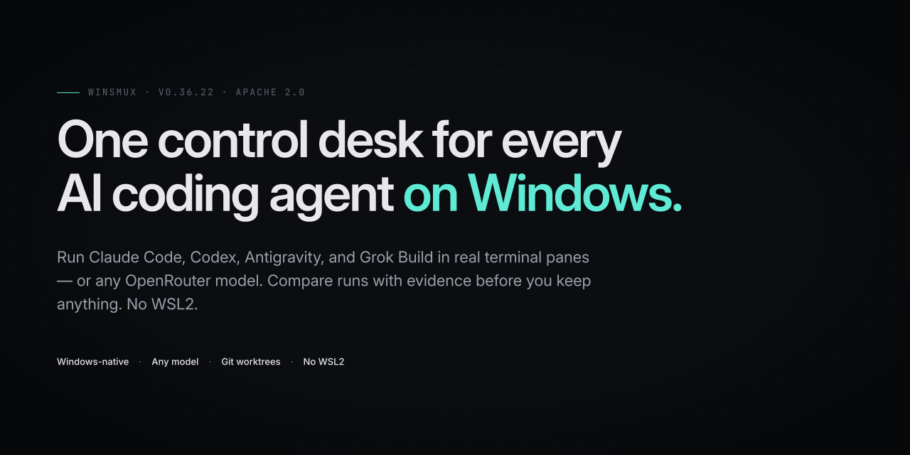

[English](README.md) | [日本語](README.ja.md)

<p align="center">
  
</p>

# winsmux

`winsmux` is a Windows-native control desk, a single human-run cockpit, for people who already use multiple coding CLIs and need to keep the work accountable.

Instead of hiding agents behind a black-box orchestrator, `winsmux` opens each worker in a real pane, keeps file changes isolated in git worktrees, lets you send or interrupt instructions, and compares completed runs with evidence such as changed-file overlap, review state, verification state, and checkpoints before you decide what to keep.

Use it when one Claude Code, Codex CLI, or Gemini CLI session is not enough, but you still want one human operator, local credentials, and a review trail.

For example: run the same task through two agents, watch both panes live, stop the one going off track, then compare the recorded evidence before accepting either result.

`winsmux` does not sign in to AI services for you. Each agent CLI keeps using its own official sign-in or API key setup.

## Why It Exists

Most tools solve only one part of this workflow.

- Terminal multiplexers show panes, but they do not know which agent changed which files.
- IDE chat surfaces are good for one conversation, but they do not give you a control plane for several official CLIs.
- Agent frameworks can automate agents, but they often move the work into code or cloud services instead of keeping a human operator in the loop.

`winsmux` sits between those categories: it keeps the official CLI agents visible, separates their work into independent working directories, records the evidence, and leaves the final choice with you.

## What It Does

- Starts a managed Windows Terminal workspace for multiple CLI agents.
- Lets an operator read, send, interrupt, and check pane health.
- Keeps worker agents in separate git worktrees when isolation is enabled.
- Compares recorded runs and highlights shared changed files before you choose a winner.
- Shows review, verification, architecture, checkpoint, and follow-up evidence for recorded runs.
- Captures structured end-of-run snapshots without storing raw terminal transcripts or private local paths.
- Stores selected credentials with Windows DPAPI instead of writing repository `.env` files.
- Records review and verification evidence for later audit.

## When To Use It

Use `winsmux` when you want to run more than one coding agent on a Windows PC and still keep a single operator in control.

It is especially useful when you want to:

- Compare work from different agents or providers.
- Keep each worker's file changes separated.
- See live pane output instead of waiting for a final summary.
- Require review evidence before accepting changes.
- Preserve enough structured context to resume or compare runs later.
- Avoid tying the workflow to one model vendor.

If you only need a terminal multiplexer, see the runtime docs under [`core/docs`](core/docs).

## Requirements

- Windows 10 or Windows 11
- PowerShell 7+
- Windows Terminal
- The CLI agents you want to run, such as Codex CLI, Claude Code, or Gemini CLI

Rust is only needed when you build the runtime from source.

## Get Started

The fastest path is:

```powershell
npm install -g winsmux
winsmux install --profile full
winsmux init
winsmux launch
```

See [Quickstart](docs/quickstart.md) for a guided first run.
See [Installation](docs/installation.md) for profiles, updates, and uninstall steps.
See [Customization](docs/customization.md) for launcher presets, worktree policy, slots, credentials, and desktop settings.

## Main Commands

```powershell
winsmux list
winsmux read worker-1 30
winsmux send worker-2 "Review the latest auth changes."
winsmux health-check
winsmux compare runs <left_run_id> <right_run_id>
winsmux compare preflight <left_ref> <right_ref>
winsmux compare promote <run_id>
winsmux meta-plan --task "Plan this change" --json
winsmux meta-plan --task "Plan this change" --roles .winsmux/meta-plan-roles.yaml --review-rounds 2 --json
winsmux skills --json
```

| Command | Purpose |
| ------- | ------- |
| `winsmux init` | Create the default project config |
| `winsmux launch` | Run checks and start the default managed workspace |
| `winsmux launcher presets` | Show launcher presets and pair templates |
| `winsmux launcher lifecycle` | Choose the workspace lifecycle policy |
| `winsmux compare runs` | Compare evidence and confidence between two recorded runs |
| `winsmux compare preflight` | Check two refs before merge or compare review |
| `winsmux compare promote` | Export a successful run as input for the next run |
| `winsmux meta-plan` | Draft a read-only multi-role planning packet before execution |
| `winsmux skills` | Print agent-readable command skill contracts |
| `winsmux read` | Read a pane before acting |
| `winsmux send` | Send text to a pane |
| `winsmux vault set` | Store a credential with Windows DPAPI |
| `winsmux vault inject` | Inject a stored credential into a target pane |

`winsmux conflict-preflight` remains available as a compatibility command behind `winsmux compare preflight`.

Compatibility aliases `psmux`, `pmux`, and `tmux` still run with a deprecation warning.
Use `winsmux` for new scripts and docs; the alias contract will be removed before `v1.0.0`.

## Git Graph CLI

The repository includes `git-graph`, a Rust CLI that renders recent Git history as a source-control-style SVG graph. It reads commit IDs and parent IDs, rebuilds lanes from the parent relationships, and draws lane shifts with cubic Bezier curves instead of parsing `git log --graph` characters.

```powershell
New-Item -ItemType Directory -Force -Path output | Out-Null
cargo run -p git-graph -- --repo . --max 30 --out output/git-graph.svg
git log --topo-order --format="%H %P" --max-count=30 | cargo run -p git-graph -- --from-stdin --out output/git-graph.svg
```

After installing or copying the binary, use the same options directly:

```powershell
git-graph --max 30 --out graph.svg
git log --topo-order --format="%H %P" --max-count=30 | git-graph --from-stdin --out graph.svg
```

## Authentication Support

| Tool | Authentication mode | winsmux support |
| ------- | ------- | ------- |
| Claude Code | API key or documented enterprise auth | Officially supported |
| Claude Code | Pro / Max OAuth | This PC only, interactive use |
| Codex CLI | API key | Officially supported |
| Codex CLI | ChatGPT OAuth | This PC only, interactive use |
| Gemini CLI | Gemini API key | Officially supported |
| Gemini CLI | Vertex AI | Officially supported |
| Gemini CLI | Google OAuth | This PC only, interactive use |

See [Authentication Support](docs/authentication-support.md) for the full policy.

## Security Notes

- Use `winsmux read` to check the target pane output before sending instructions.
- Keep one human operator responsible for final accept or reject decisions.
- Keep the managed worktree lifecycle enabled when agents edit files in parallel.
- Do not paste API keys into pane chat or issue comments.
- Use `winsmux vault` for credentials that must be injected into a pane.
- Treat compare results and release evidence as review inputs, not automatic approval.

## Related Docs

- [Operator model](docs/operator-model.md)
- [Documentation overview](docs/README.md)
- [Quickstart](docs/quickstart.md)
- [Installation](docs/installation.md)
- [Customization](docs/customization.md)
- [Authentication support](docs/authentication-support.md)
- [Troubleshooting](docs/TROUBLESHOOTING.md)
- [Repository surface policy](docs/repo-surface-policy.md)
- [Runtime features](core/docs/features.md)
- [Runtime configuration](core/docs/configuration.md)
- [tmux compatibility](core/docs/compatibility.md)

Developer and contributor rules are intentionally kept out of this README. Start from [Repository surface policy](docs/repo-surface-policy.md) if you are changing the repository itself.

## License

Apache License 2.0.

Some runtime compatibility code keeps an upstream MIT notice under `core/LICENSE`.
See [Third-party notices](THIRD_PARTY_NOTICES.md) for the split.
