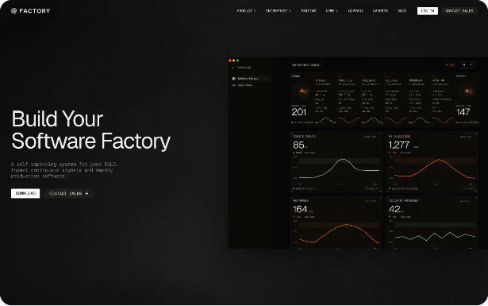
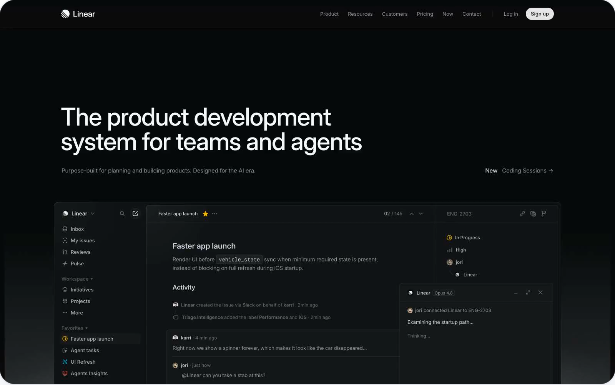
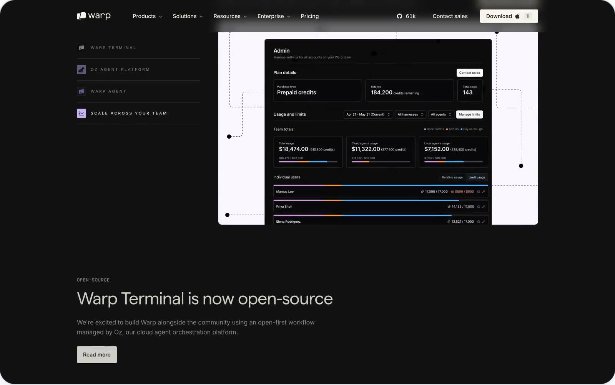
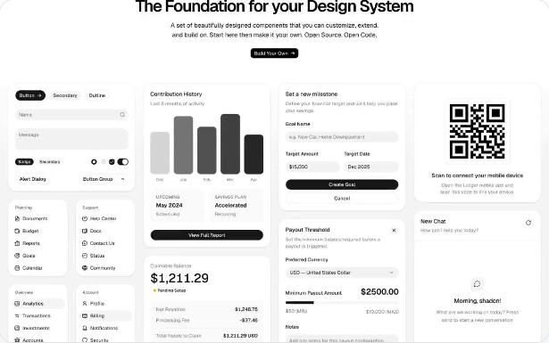

# TASK-760 Refero Styles 実画面調査

## 成果契約

- **done**: `styles.refero.design` のライブ画面で確認した Command Deck 向け候補を3〜5件に絞り、各候補のURL、スクリーンショット、比較表、採用範囲を同じ成果物に結び付ける。
- **検証方法**: Playwright CLIで各URLへ遷移し、同じブラウザーセッションからプレビュー画像を取得する。ファイル数、PNG署名、SHA-256、Markdown内のURL・画像参照を機械照合する。
- **target_version**: `v0.36.39`
- **非対象**: 製品UI、色トークン、既存のCommand Deck設計、Refero以外の競合調査は変更しない。TASK-761がこの調査結果を設計へ統合する。

## 調査方法

2026-08-28 12:14〜12:15 JSTに、Playwright CLIの専用セッションをMicrosoft Edgeで起動し、各候補の詳細ページを開いた。候補名、説明、色・余白・境界の記述をライブDOMで確認し、同じページのPreview画像をPNGとして保存した。

```text
npx --yes --package @playwright/cli playwright-cli -s=task760 open https://styles.refero.design/ --browser msedge --headed
npx --yes --package @playwright/cli playwright-cli -s=task760 goto <candidate-url>
npx --yes --package @playwright/cli playwright-cli -s=task760 run-code <preview-screenshot-function>
```

候補の条件は、端末文字の可読性、密度、pane境界、状態の視認性、単一アクセント、装飾依存の少なさである。スクリーンショットを取得できなかった候補は比較対象へ入れていない。

## 比較結果

| 候補 | ライブURL | 実画面で確認した特性 | Command Deckへの採用範囲 | 判断 |
|---|---|---|---|---|
| **Factory** | [Refero Styles](https://styles.refero.design/style/13d6fc89-eba2-4724-ac37-20f4f2e5efec) | near-blackの計器面、細い境界、低いradius、monospaceの状態ラベル。色はorange/greenの状態信号に限定し、shadowやblurに依存しない | dark shell、pane境界、状態色の使い方 | **基準として採用** |
| **Linear** | [Refero Styles](https://styles.refero.design/style/90ce5883-bb24-4466-93f7-801cd617b0d1) | near-blackの段階面、0.5px級のhairline、compact padding、低weightの文字。プロダクトUI自体を主役にする | 密度、幾何学的な階層、静かな背景 | 部分採用。acid-limeや多数の補助色は持ち込まない |
| **Warp** | [Refero Styles](https://styles.refero.design/style/d4c51049-58eb-404a-9fcb-f195928b1c99) | matte black、狭いgap、小さい本文、neutral surfaceの段階、violetを小さな機能的句読点として使用 | IDE相当の密度、面の積層、端末中心の構図 | 部分採用。pill中心のCTAと独自書体は持ち込まない |
| **Ui** | [Refero Styles](https://styles.refero.design/style/0fd67ec5-7e9c-4ca9-b368-5d9c7388477a) | white/warm-grayの面、hairline card、情報密度の高いcomponent grid。赤は破壊的状態に限定 | light theme、カード境界、フォーム・設定面 | light側の参考として採用。dark shellの基準にはしない |
| **Steep** | [Refero Styles](https://styles.refero.design/style/75fdb89f-ca64-41b3-af36-7a78bd09448e) | warm paper、serif見出し、分析カード、広い余白、peachの単一アクセント | benchmark/reportなどの分析面 | Command Deck shellからは除外。TASK-576のreport用途は維持 |

## スクリーンショット

### Factory — dark shellの基準



### Linear — compactな精密面



### Warp — IDE相当の密度



### Ui — light themeの境界設計



### Steep — 分析面に限定する比較対象


## 採用理由

Command Deckの主基準はFactoryとする。理由は、winsmuxの中心が「端末を含む作業面」であり、Factoryは色を装飾ではなく状態へ割り当て、細線と面差だけで階層を作るためである。これは既存方針のmatte command deck、terminal readability、status colors as data punctuationと一致する。

単一のブランド模倣にはしない。Linearからcompactな幾何、WarpからIDE密度、Uiからlight側のhairline構造だけを借りる。Steepは分析レポートには適合するが、serifと広い余白が常時操作するCommand Deckの密度を下げるため、shellには採用しない。

## 証跡manifest

| ファイル | bytes | SHA-256 |
|---|---:|---|
| `factory.png` | 95,090 | `55ACA091A9BA0EBD2424138344DFA842391156E415137E77578831DF9A2B72E6` |
| `linear.png` | 76,037 | `8EECF2F785ABC6EAC3E5D50FA6656114C4E052515F299965835D8F8D915BEBEC` |
| `steep.png` | 139,663 | `0326536310FD017FBC2938274DE6EA9425A1AE8B95E1CC905F610F4159497784` |
| `ui.png` | 88,427 | `11D2DA56D13028B2172AC12EBD94C019BEF9CE101B592B04BB1A008540A53AE5` |
| `warp.png` | 72,681 | `DE370AAC4FE665AED2C00574B2F8EB80F1DC5086C908FAA731938A6BDC453457` |

このmanifestは、上記ライブ調査で取得した5ファイルを対象にする。Preview以外のブラウザログ、snapshot、セッション状態は成果物へ含めない。
