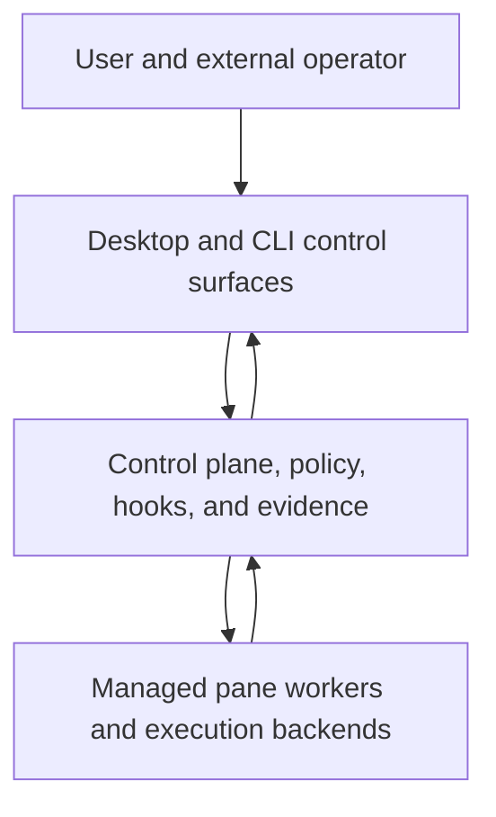
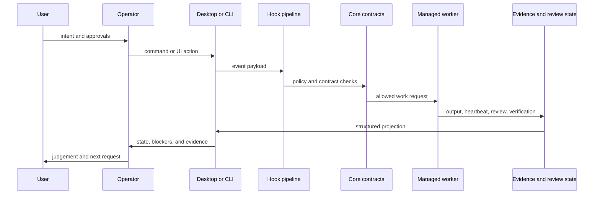
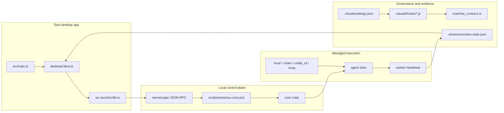

# Architecture

This document is an internal planning and governance surface for `TASK-047`.
It records the current winsmux architecture without turning enterprise
governance goals into public product promises.

Public product positioning remains in `README.md` and `docs/operator-model.md`.

## Scope

`TASK-047` asked for `ARCHITECTURE.md` with a 4-layer diagram, a 22-hook
inventory, data flow, and a component diagram.

The original planning text used "22 hooks" as the historical governance target.
The current repository has grown past that baseline:

- 28 hook script files exist under `.claude/hooks/`.
- 31 hook command registrations exist in `.claude/settings.json`.

This document therefore treats the current inventory as source of truth and
keeps the 22-hook wording as historical acceptance context.

## Requirement Baseline

`TASK-045` was the requirement-document prerequisite for this work. The old
`docs/REQUIREMENTS.md` artifact existed in repository history and was later
removed with other internal files so live operational and governance material
would not be tracked as public documentation.

The current requirement baseline for this architecture is:

- `docs/operator-model.md` for the public operator contract.
- `docs/external-control-plane.md` for the local pipe and JSON-RPC boundary.
- `docs/repo-surface-policy.md` for public, runtime, contributor, private, and
  generated surface rules.
- `core/src/machine_contract.rs` for typed role, worker, event, verdict, and
  projection contracts.
- `.claude/settings.json` and `.claude/hooks/*.js` for the current hook
  registration pipeline.

## Four-Layer Architecture

Layer responsibilities:

| Layer | Main responsibility | Primary contracts |
| --- | --- | --- |
| User and external operator | Own intent, approval, escalation, and final judgement | `docs/operator-model.md` |
| Desktop and CLI control surfaces | Present workspace, sessions, panes, decisions, and diagnostics | `winsmux-app/src/main.ts`, `winsmux-app/src/desktopClient.ts`, `scripts/winsmux-core.ps1` |
| Control plane, policy, hooks, and evidence | Enforce local policy, record evidence, expose machine-readable state | `.claude/settings.json`, `.claude/hooks/*.js`, `core/src/machine_contract.rs` |
| Managed pane workers and execution backends | Run assigned work inside local, isolated, or future backend slots | `winsmux workers *`, `agent-slots`, worker backend contracts |

## Data Flow

The important boundary is that prompt text does not grant authority. Authority
is carried by explicit user action, policy artifacts, local control-plane
contracts, and hook decisions.

## Component Diagram

## Hook Inventory

The hook pipeline is registered in `.claude/settings.json`. It is event based
and command oriented. A single script can be registered under more than one
event or matcher.

| Event | Matcher | Registered hook commands |
| --- | --- | --- |
| `SessionStart` | all | `sh-session-start.js` |
| `SessionEnd` | all | `sh-session-end.js` |
| `PreToolUse` | `Bash` | `sh-gate.js`, `sh-injection-guard.js`, `sh-channel-detect.js`, `sh-quiet-inject.js`, `sh-data-boundary.js`, `sh-issue-gate.js` |
| `PreToolUse` | `WebFetch` | `sh-injection-guard.js`, `sh-data-boundary.js` |
| `PreToolUse` | `Edit|Write|Read` | `sh-invisible-char-scan.js`, `sh-injection-guard.js` |
| `PreToolUse` | all | `sh-orchestra-gate.js`, `sh-permission.js` |
| `PostToolUse` | all | `sh-evidence.js`, `sh-output-control.js`, `sh-pane-monitor.js` |
| `PostToolUse` | `Edit|Write` | `lint-on-save.js` |
| `PostToolUse` | `Bash` | `sh-dep-audit.js` |
| `UserPromptSubmit` | all | `sh-user-prompt.js` |
| `Stop` | all | `sh-circuit-breaker.js` |
| `SubagentStart` | all | `sh-subagent.js` |
| `WorktreeCreate` | all | `sh-worktree.js` |
| `PreCompact` | all | `sh-precompact.js` |
| `PostCompact` | all | `sh-postcompact.js` |
| `Elicitation` | all | `sh-elicitation.js` |
| `ConfigChange` | all | `sh-config-guard.js` |
| `InstructionsLoaded` | all | `sh-instructions.js` |
| `PermissionRequest` | all | `sh-permission-learn.js` |
| `TaskCompleted` | all | `sh-pipeline.js`, `sh-task-gate.js` |

Current script files:

| Group | Scripts |
| --- | --- |
| Session lifecycle | `sh-session-start.js`, `sh-session-end.js`, `sh-precompact.js`, `sh-postcompact.js`, `sh-circuit-breaker.js` |
| Input and tool gating | `sh-gate.js`, `sh-injection-guard.js`, `sh-channel-detect.js`, `sh-quiet-inject.js`, `sh-data-boundary.js`, `sh-invisible-char-scan.js` |
| Permission and configuration | `sh-permission.js`, `sh-permission-learn.js`, `sh-config-guard.js`, `sh-instructions.js`, `sh-elicitation.js` |
| Evidence and output | `sh-evidence.js`, `sh-output-control.js`, `sh-pane-monitor.js`, `sh-dep-audit.js` |
| Work orchestration | `sh-orchestra-gate.js`, `sh-subagent.js`, `sh-worktree.js`, `sh-pipeline.js`, `sh-task-gate.js`, `sh-issue-gate.js`, `sh-user-prompt.js`, `lint-on-save.js` |

## Control Boundaries

- The external pipe is local-only and exposes a small JSON-RPC allowlist.
- Internal Tauri methods do not automatically become external pipe methods.
- Worker status is projected from shared CLI and Rust contracts, not from raw
  terminal text.
- Enterprise execution policy is explicit opt-in and must not be implied by
  prompt wording.
- Public docs must not turn internal governance checks into user-facing product
  guarantees.

## Traceability

| Planning task | Current evidence |
| --- | --- |
| `TASK-045` | Requirement baseline is represented by existing public and contract docs listed above. The historical `docs/REQUIREMENTS.md` file was removed from tracked public docs. |
| `TASK-047` | This document records the architecture, current hook inventory, data flow, and component diagram. |
| `TASK-048` | `docs/project/DETAILED_DESIGN.md` records hook I/O, matching rules, branch logic, and test templates. |
