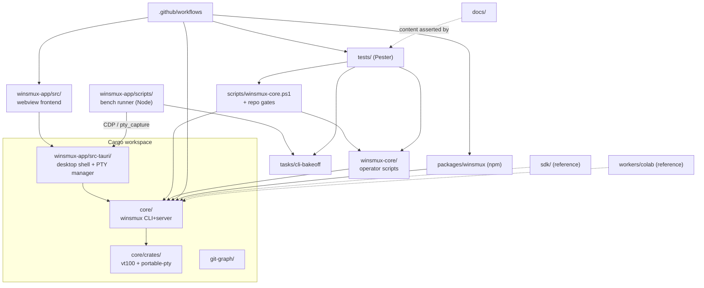

# Component Map and Dependency Graph

TASK-628 deliverable for the v0.36.24 design-debt inventory lane. This maps
every tracked top-level component to an owner surface, shows the dependency
edges between them, and records the orphan-subsystem check. Counts come from
`git ls-files` grouped by top-level path on 2026-07-06 (main at `b4f1343d`);
regenerate the same way when re-auditing.

## Ownership map

| Component | Language / kind | Tracked files | Responsibility | Primary consumers |
| --- | --- | --- | --- | --- |
| `core/` | Rust (workspace member) | 299 | The `winsmux` CLI/server binary: tmux-compatible runtime, sessions, panes, operator CLI contracts. Vendors `core/crates/vt100-winsmux` and `core/crates/portable-pty-winsmux`. Contract tests live in `core/tests-rs/`. | `scripts/winsmux-core.ps1`, `winsmux-core/` scripts, release binaries, npm package |
| `winsmux-app/` | TypeScript + Rust (Tauri) | 75 | Desktop app: `src/` webview frontend (xterm panes, operator composer), `src-tauri/` Rust shell (workspace member; in-process PTY manager, `pty_capture`/`pty_write` commands), `scripts/` durable bench runner (Node), npm-script E2E tests. | End users, bench runner over CDP, release desktop workflow |
| `winsmux-core/` | PowerShell + Node | 65 | Operator/orchestra layer: `scripts/` (54 files: orchestra-start, settings, sync-roadmap, planning-paths...), `psmux-bridge.ps1`, `mcp-server.js`, `agents/`, `router/`. | Operator sessions, `scripts/winsmux-core.ps1` bridge |
| `scripts/` | PowerShell | 29 | Repo-level entry points and gates: `winsmux-core.ps1` (bridge CLI), `start-cli-bakeoff-desktop.ps1`, `summarize-cli-bakeoff.ps1`, `audit-public-surface.ps1`, `git-guard.ps1`, `validate-legacy-compat-inventory.ps1`, focused test drivers. | Operators, CI workflows |
| `tests/` | PowerShell (Pester) | 46 | The CI Pester suite matrix (bridge, worker, benchmark, public-surface, version-surface policies). | `.github/workflows` test matrix |
| `docs/` | Markdown/HTML | 57 | Public docs, project planning notes, incident records, benchmark contract, generated internal inventories (`docs/internal/`, written by sync-roadmap). | Users, release reviewers, gates that assert on doc content |
| `tasks/` | Markdown/JSON | 30 | Harness Bench task pack (`tasks/cli-bakeoff/v1`: benchmark-pack.json + WB-*.md packets). | Bench runner, preflight/summarize scripts |
| `.github/` | YAML | 10 | CI: build-core/build-desktop/tests matrices, release workflows (core/desktop/npm), Gitleaks, public-surface audit, merge gate. | Every PR and release |
| `git-graph/` | Rust (workspace member) | 9 | Git history graph utility crate kept in the workspace. | `core`/desktop features that render history |
| `packages/winsmux` | npm package | 3 | npm distribution wrapper for the CLI binaries. | `Release npm Package` workflow, npm users |
| `sdk/` | Python + TypeScript | 3 | Client SDK reference stubs (`sdk/python/winsmux.py`, `sdk/typescript/winsmux.ts`). | Reference only (see orphan check) |
| `workers/colab` | Python | 5 | Colab worker reference scripts (scout/impl/test/critic/heavy-judge). | Reference only (see orphan check) |
| `.githooks/` | Shell/PS | 3 | Local git hooks (guard scripts). | Contributor machines |
| Root files | — | ~15 | `VERSION` (version surface), `install.ps1` (installer), READMEs (en/ja), policies (SECURITY, CONTRIBUTING, GUARDRAILS), agent contracts (AGENT*.md, GEMINI.md). | Users, gates (VersionSurface tests) |

Untracked-by-design: `.winsmux/` (local evidence), `.worktrees/`, `target/`, `node_modules/`, `output/`, `HANDOFF.md` and other local operator state. These are runtime/products, not components.

## Dependency graph

Solid edges are build/runtime dependencies; dotted edges are reference or
assertion relationships. Two runtime universes coexist deliberately: `core`'s
psmux server sessions and the desktop app's in-process Tauri PTYs (the
distinction that produced #1128's capture fix); the bench runner reaches the
latter only through CDP.

## Orphan-subsystem check

Verdict: no orphan subsystems; two reference-only components need explicit
classification in the follow-up inventory tasks.

- Every top-level component above has at least one consumer edge except
  `sdk/` and `workers/colab`, which are reference implementations with no CI
  coverage and no build wiring. They are intentionally shipped as examples,
  but nothing asserts they still match the CLI surface.
- Action carried into TASK-629 (contract/source-of-truth inventory) and
  TASK-631 (compatibility/deprecation policy): classify `sdk/` and
  `workers/colab` as maintained-contract, reference-only, or
  removal-candidate before v1.0.0.
- `git-graph/` is consumed via the Cargo workspace build; it stays in the map
  as a normal member.
- Generated surfaces (`docs/internal/*`) are owned by
  `winsmux-core/scripts/sync-roadmap.ps1`; hand-editing them is prohibited by
  the planning operating rules.

## Method

- File counts: `git ls-files` grouped by first path segment (2026-07-06).
- Workspace membership: root `Cargo.toml` (`core`, `git-graph`,
  `winsmux-app/src-tauri`).
- Frontend/tooling edges: `winsmux-app/package.json` scripts and
  dependencies; `winsmux-core/` and `scripts/` inventories.
- This is a module-level map on purpose; per-file fan-in/fan-out metrics are
  TASK-630's scope.
