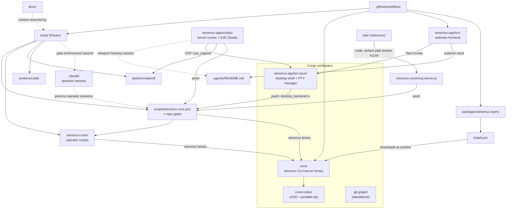

# Component Map and Dependency Graph

TASK-628 deliverable for the v0.36.24 design-debt inventory lane. This maps
every tracked top-level component to an owner surface, shows the dependency
edges between them, and records the orphan-subsystem check. Counts come from
`git ls-files` grouped by top-level path on 2026-07-06 (main at `b4f1343d`).
Every edge below was verified against tracked source with `git grep` /
file reads (see the Method section); the cited `file:line` refs are the proof,
not the doc's own assertion.

## Ownership map

| Component | Language / kind | Tracked files | Responsibility | Primary consumers |
| --- | --- | --- | --- | --- |
| `core/` | Rust (workspace member) | 299 | The `winsmux` CLI/server binary: tmux-compatible runtime, sessions, panes, operator CLI contracts. Vendors `core/crates/vt100-winsmux` and `core/crates/portable-pty-winsmux`. Contract tests live in `core/tests-rs/`. | `scripts/winsmux-core.ps1` and `winsmux-core/` scripts (invoke the binary), npm package (downloads it) |
| `winsmux-app/` | TypeScript + Rust (Tauri) | 75 | Desktop app: `src/` webview frontend (xterm panes, operator composer), `src-tauri/` Rust shell (workspace member; in-process PTY manager, `pty_capture`/`pty_write` commands), `scripts/` durable bench runner (Node), npm-script E2E tests. Note: `src-tauri` does NOT depend on the `core` crate — it reaches core functionality by shelling out to the PowerShell bridge (see the boundary note below). | End users, bench runner over CDP, release desktop workflow |
| `winsmux-core/` | PowerShell + Node | 65 | Operator/orchestra layer: `scripts/` (54 files: orchestra-start, settings, sync-roadmap, planning-paths, dispatch-router...), `psmux-bridge.ps1`, `mcp-server.js` (the SDK's entry point), `agents/`, `router/`. | Operator sessions, `scripts/winsmux-core.ps1` bridge, SDK stubs |
| `.claude/` | Markdown + JS + JSON | 41 | Claude Code operator harness: the repo-safe operator contract (`.claude/CLAUDE.md`), dispatch rules (`.claude/rules/`), and PreToolUse gate hooks (`.claude/hooks/sh-orchestra-gate.js`, registered in `.claude/settings.json`) that enforce the operator boundary. | Operator sessions; asserted by `tests/Integration.GateEnforcement.Tests.ps1` |
| `scripts/` | PowerShell | 29 | Repo-level entry points and gates: `winsmux-core.ps1` (the bridge CLI that resolves and invokes the `winsmux` binary), `start-cli-bakeoff-desktop.ps1`, `summarize-cli-bakeoff.ps1`, `audit-public-surface.ps1`, `git-guard.ps1`, `validate-legacy-compat-inventory.ps1`, focused test drivers. | Operators, CI, the desktop app (via pwsh), `winsmux-core/mcp-server.js` |
| `tests/` | PowerShell (Pester) | 46 | The CI Pester suite matrix (bridge, worker, benchmark, public-surface, version-surface policies, gate-enforcement). | `.github/workflows` test matrix |
| `docs/` | Markdown/HTML | 57 | Public docs, project planning notes, incident records, benchmark contract, generated internal inventories (`docs/internal/`, written by sync-roadmap). | Users, release reviewers, gates that assert on doc content |
| `tasks/` | Markdown/JSON | 30 | Harness Bench task pack (`tasks/cli-bakeoff/v1`: benchmark-pack.json + WB-*.md packets). | Bench runner, preflight/summarize scripts, `tests/CliBakeoff.Tests.ps1` |
| `.github/` | YAML | 10 | CI: build-core/build-desktop/tests matrices, release workflows (core/desktop/npm), Gitleaks, public-surface audit, merge gate. | Every PR and release |
| `git-graph/` | Rust (workspace member) | 9 | Standalone git history graph crate. Built as a workspace member, but no in-repo code imports or invokes it (only workspace membership and a git-hook whitelist reference it). | None in-repo — standalone/manual tooling (see orphan check) |
| `packages/winsmux` | npm package | 3 | npm distribution wrapper. Does NOT bundle binaries; `index.mjs` spawns `install.ps1`, which downloads `winsmux-x64.exe`/`winsmux-arm64.exe` from the GitHub Release assets at install time. | `Release npm Package` workflow, npm users |
| `sdk/` | Python + TypeScript | 3 | Client SDK stubs. Intended chain: `node winsmux-core/mcp-server.js` -> bridge -> core (they do NOT import the Rust `core` crate). The DEFAULT server path is currently mis-resolved to a non-existent `<repo>/winsmux/mcp-server.js` (should be `winsmux-core/`) — bug #1144; only a caller passing an explicit server path reaches mcp-server today. No CI coverage. | Reference / external SDK users (see orphan check) |
| `workers/colab` | Python | 5 | Colab worker templates (scout/impl/test/critic/heavy-judge). | Enumerated and executed by `tests/ColabWorkerTemplates.Tests.ps1` in the `worker-benchmark` CI matrix |
| `.agents/` | Markdown | 1 | Agent workspace README (`.agents/README.md`; `.agents/skills/` is gitignored). | Desktop file explorer default seed (`fallbackExplorerPaths`, `winsmux-app/src/main.ts:1428`); asserted by the viewport-harness E2E (`winsmux-app/scripts/viewport-harness.mjs:1745`) |
| `.githooks/` | Shell/PS | 3 | Local git hooks (guard scripts, pre-commit whitelist). | Contributor machines |
| Root files | — | ~15 | `VERSION` (version surface), `install.ps1` (installer that downloads the release binaries), READMEs (en/ja), policies (SECURITY, CONTRIBUTING, GUARDRAILS), agent contracts (AGENT*.md, GEMINI.md). | Users, `packages/winsmux`, gates (VersionSurface tests) |

Untracked-by-design: `.winsmux/` (local evidence), `.worktrees/`, `target/`, `node_modules/`, `output/`, `HANDOFF.md` and other local operator state. These are runtime/products, not components.

## Dependency graph

Solid edges are build/runtime dependencies; dotted edges are reference or
assertion relationships. Every non-core surface that needs the runtime reaches
it through a PowerShell layer rather than by linking the Rust crate: the
desktop Tauri shell (`desktop_backend.rs`), the Node bench runner/E2E scripts,
and the SDK's `mcp-server.js` all shell out to PowerShell. Resolving and
invoking the `winsmux` binary is NOT centralized in a single script — it
happens in `scripts/winsmux-core.ps1` (the main bridge, `Resolve-WinsmuxRawCommand`),
in `winsmux-core/scripts/settings.ps1` (`Get-WinsmuxBin`), and in
`winsmux-core/psmux-bridge.ps1` (`Get-Command winsmux`). The contract those
surfaces depend on is "a PowerShell process that shells to the binary", not one
resolver.

## Architectural boundary note (input to TASK-631 / TASK-632)

The boundary between the desktop app and the Rust core is a **process boundary
(the PowerShell bridge), not a Rust API**: `winsmux-app/src-tauri` declares no
dependency on the `core` crate and contains zero `use winsmux::` imports; it
invokes `scripts/winsmux-core.ps1` via `pwsh` (`desktop_backend.rs`:
`spawn_desktop_summary_refresh_stream`, `run_winsmux_json`). Two runtime
universes also coexist deliberately: `core`'s psmux-compatible server sessions
and the desktop app's in-process Tauri PTYs (the distinction behind the #1128
capture fix — the bench runner reaches the latter only via CDP `pty_capture`,
never through psmux). The design-freeze work should treat "the bridge command
surface" as the contract the desktop and SDK depend on, and should decide
whether that indirection is intended or a debt to collapse.

## Orphan-subsystem check

Verdict: no undocumented orphan subsystems; two components need explicit
classification in the follow-up inventory tasks.

- `git-graph/` builds as a workspace member but has NO in-repo consumers
  (verified: outside its own directory the name appears only in root
  `Cargo.toml`/`Cargo.lock` workspace membership and
  `.githooks/pre-commit-whitelist.ps1`). Effectively standalone tooling that
  every workspace build still compiles.
- `sdk/` has an intended runtime path to core (`node mcp-server.js` -> bridge
  -> binary), but its default server path is broken (points to a non-existent
  `winsmux/mcp-server.js`, bug #1144) and NO CI coverage asserts the stubs
  match the surface — a concrete instance of the missing-coverage debt.
- `.agents/` is NOT an orphan: the desktop file explorer seeds
  `.agents/README.md` in `fallbackExplorerPaths` (`winsmux-app/src/main.ts:1428`,
  consumed at :5748) and the viewport-harness E2E
  (`winsmux-app/scripts/viewport-harness.mjs:1745`) asserts the folder expands —
  removing it would break both.
- Action carried into TASK-629 (contract/source-of-truth inventory) and
  TASK-631 (compatibility/deprecation policy): classify `git-graph/` and `sdk/`
  as maintained-contract, reference-only, or removal-candidate before v1.0.0.
- `workers/colab` is NOT an orphan: `tests/ColabWorkerTemplates.Tests.ps1`
  (worker-benchmark CI matrix) enumerates and executes every
  `workers/colab/*_worker.py` template.
- Generated surfaces (`docs/internal/*`) are owned by
  `winsmux-core/scripts/sync-roadmap.ps1`; hand-editing them is prohibited by
  the planning operating rules.

## Method

- File counts: `git ls-files` grouped by first path segment (2026-07-06).
- Workspace membership: root `Cargo.toml` (`core`, `git-graph`,
  `winsmux-app/src-tauri`).
- Every dependency edge was verified against tracked source before being drawn.
  Representative proofs:
  - `tauri` has no `core` dependency: `winsmux-app/src-tauri/Cargo.toml` deps +
    zero `use winsmux::` in `winsmux-app/src-tauri/src/`.
  - `tauri -> bridge`: `winsmux-app/src-tauri/src/desktop_backend.rs`
    (`spawn_desktop_summary_refresh_stream` ~L2099, `run_winsmux_json` ~L2551
    build `repo_root/scripts/winsmux-core.ps1` and spawn `pwsh`).
  - `bridge -> core`: `scripts/winsmux-core.ps1` `Resolve-WinsmuxRawCommand` /
    `Invoke-WinsmuxRaw` resolve and run `target/release/winsmux.exe`.
  - `sdk -> mcp-server -> bridge`: `sdk/python/winsmux.py` and
    `sdk/typescript/winsmux.ts` spawn `node <path>/mcp-server.js`, which
    `execFileSync("pwsh", ...)` the bridge script. The default `<path>` is
    currently the non-existent `winsmux/` (bug #1144); the intended target is
    `winsmux-core/mcp-server.js`.
  - `npm -> installer -> core`: `packages/winsmux/index.mjs` spawns
    `install.ps1`, which downloads the release binaries.
  - `.agents` is consumed (not an orphan): `.agents/README.md` is in
    `fallbackExplorerPaths` (`winsmux-app/src/main.ts:1427-1428`, used at :5748)
    and asserted by `winsmux-app/scripts/viewport-harness.mjs` (~L1745).
    Cross-checked that `git-graph/` and `sdk/` have no such desktop-UI seed.
- This is a module-level map on purpose; per-file fan-in/fan-out metrics are
  TASK-630's scope.
