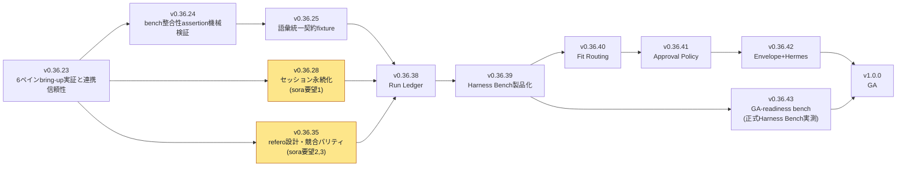

# Roadmap 10x Lanes — v0.36.38〜42 計画拡張

## (a) 目的と経緯

2026-07-02、Fable 5パケットゲートのPROCEED判定（スコア85）後、Max監査でfindings 12件が確認された。主要な指摘はIP-1（Desktop Start evidence gateの検証範囲）とIP-2（状態語彙契約のドリフト防止）で、これを受けてsoraから3点の要望——(1) セッション永続化、(2) refero.design由来のdesign.md精緻化、(3) 競合パリティ基準の確定——が出され、計画拡張が承認された。本書はその計画拡張として `backlog.yaml` に追記されたTASK-721〜764（44件）のうち、新設5レーン（v0.36.38〜42）と既存レーン追記11タスク（v0.36.23/24/25/28/35）を整理し、依存関係とテスト戦略を一覧化する補助文書である。

## (b) 新レーン5本+追記11タスクの概要表

### 新設5レーン（v0.36.38〜42）

| ID | version | タイトル | 受け入れ基準要点 |
|---|---|---|---|
| TASK-724 | v0.36.38 | Run LedgerとEvidence Search基盤の親タスク | 配下タスク（TASK-725〜730）完了かつPester/Rust/E2Eを含むレーン公開前ゲート通過 |
| TASK-725 | v0.36.38 | run記録スキーマと永続化 | claim/テスト結果/changed files/timestamp/confidence/workerを含みraw log非含有。再起動後検索一致E2E、raw log混入時サニタイズscan FAIL |
| TASK-726 | v0.36.38 | 証拠検索のlocal-only API | 期間/worker/label/結果フィルタ、local-only境界維持テスト |
| TASK-727 | v0.36.38 | リプレイビュー（Evidence Bottom Deck統合） | bounded summaryのみ表示、raw log非表示をE2Eで固定 |
| TASK-728 | v0.36.38 | 保持ポリシーとサニタイズゲート | retention設定と公開前scan統合、secretパターン混入時FAIL負テスト |
| TASK-729 | v0.36.38 | 既存Feed・Checkpoint記録の取り込み移行 | 移行前後の件数比較で欠落・重複なし |
| TASK-730 | v0.36.38 | Run Ledger公開前ゲートとリリース | レーンE2E・回帰・GitHub Release・post-release smoke通過 |
| TASK-731 | v0.36.39 | Harness Bench製品化の親タスク | 配下タスク（TASK-732〜737）完了かつPester/E2Eレーン公開前ゲート通過 |
| TASK-732 | v0.36.39 | repo別bench packカスタム定義 | pack schema検証テスト、不正pack理由つき拒否負テスト |
| TASK-733 | v0.36.39 | スコア履歴のledger統合 | bench結果を時系列蓄積し検索可能 |
| TASK-734 | v0.36.39 | 比較レポート常設ビュー | 常設ビューの表示・操作をE2Eで固定 |
| TASK-735 | v0.36.39 | 整合性assertionの標準ゲート化 | TASK-723の機械検証assertionを全bench実行の必須標準ゲート化 |
| TASK-736 | v0.36.39 | 除外run会計とreference-onlyラベリング | 除外理由の機械記録、アプリ外run強制reference-onlyラベル |
| TASK-737 | v0.36.39 | Bench製品化公開前ゲート | レーンE2E・回帰・リリース通過 |
| TASK-738 | v0.36.40 | Model-Task Fit Routingの親タスク | 配下タスク（TASK-739〜743）完了かつテスト伴うレーン公開前ゲート通過 |
| TASK-739 | v0.36.40 | task種別分類スキーマ | labels→task classの写像をテストで固定 |
| TASK-740 | v0.36.40 | fitスコア計算 | bench履歴+task class+modelCapabilities統合、決定的計算をテストで固定 |
| TASK-741 | v0.36.40 | dispatch推薦（operator承認必須） | 推薦理由必須表示、自動割当なし、承認なし自動dispatch負テストFAIL |
| TASK-742 | v0.36.40 | 推薦の決定的再現fixture | 同一履歴fixtureから常に同一推薦を再現 |
| TASK-743 | v0.36.40 | Fit Routing公開前ゲート | レーンE2E・回帰・リリース通過 |
| TASK-744 | v0.36.41 | Approval Policy Engineの親タスク | 配下タスク（TASK-745〜749）完了かつ公開前ゲート通過 |
| TASK-745 | v0.36.41 | ポリシースキーマ（破壊操作は常時ask強制） | destructive操作をauto-allowと定義不能な構造をschema検証テストで固定 |
| TASK-746 | v0.36.41 | 承認キュー・Attention Center統合 | 承認導線の表示・操作をE2Eで固定 |
| TASK-747 | v0.36.41 | ポリシー評価エンジンと自動承認の監査記録 | 全自動承認のrun ledger記録をテストで確認 |
| TASK-748 | v0.36.41 | 破壊操作autoallow負テスト | 誤定義ポリシーのロード時FAILを確認 |
| TASK-749 | v0.36.41 | Approval Policy公開前ゲート | レーンE2E・回帰・リリース通過 |
| TASK-750 | v0.36.42 | EnvelopeとHermes projectionの親タスク | 配下タスク（TASK-751〜756）完了かつE2Eレーン公開前ゲート通過 |
| TASK-751 | v0.36.42 | task envelope schema | id/claim/evidence refs/ackを含む契約パッケージ型生成、型生成テスト固定 |
| TASK-752 | v0.36.42 | mailbox封筒化移行（Reliable Mailbox後方互換） | 既存Reliable Mailbox利用者への後方互換テストgreen |
| TASK-753 | v0.36.42 | Hermes projection読み取り専用 | Telegram上の読み取り専用frontend限定projection、境界テスト固定 |
| TASK-754 | v0.36.42 | Hermes承認応答（approve/denyのみ） | 操作系コマンド一切許可なし、operator boundary維持テスト |
| TASK-755 | v0.36.42 | セキュリティ境界検証 | local-only API経由のみ、平文トークン受け渡し検出FAIL負テスト |
| TASK-756 | v0.36.42 | EnvelopeとHermes公開前ゲート | レーンE2E・回帰・リリース通過 |

### 既存レーン追記11タスク（v0.36.23/24/25/28/35）

| ID | version | タイトル | 受け入れ基準要点 |
|---|---|---|---|
| TASK-721 | v0.36.23 | stale launcher負テストの欠落確認と追補 | desktop start evidence gateへの負テスト充足確認、欠落時はPester追補、CI green維持 |
| TASK-723 | v0.36.24 | bench整合性assertionのpreflight機械検証化 | operator非採点/同一タスクセット/介入ゼロ/worker間メッセージング無効の4invariantをpreflight assertion化 |
| TASK-722 | v0.36.25 | worker状態・モデル可用性語彙の統一契約fixture | modelCapabilities.tsとTASK-634正本契約の語彙一致検証、divergence注入時red転じるfixture |
| TASK-757 | v0.36.28 | セッション永続化アーキテクチャ決定と層1実装 | SessionRegistry/Context Capsule/Checkpointによる終了時自動スナップショット、Pester+Rustで復元候補列挙green |
| TASK-758 | v0.36.28 | アプリ再起動復元のpackaged E2E | 起動/worker作業/終了/再起動で会話文脈・pane配置・モデル割当復元をpackaged E2Eで検証 |
| TASK-759 | v0.36.28 | 異常終了復元と明示的失敗表示 | プロセスkill相当の異常終了復元、失効セッションのsetup-required明示表示、ready誤表示は負テストでFAIL |
| TASK-760 | v0.36.35 | styles.refero.design実画面調査とスタイル候補抽出 | Playwrightで実画面調査、候補3-5件+スクリーンショット証跡、証跡なし候補は不採用 |
| TASK-761 | v0.36.35 | design.md v2作成（refero統合） | TASK-760統合、実装可能粒度確定、TASK-694凍結入力指定 |
| TASK-762 | v0.36.35 | P0競合8ツール実画面・機能調査マトリクス | 8ツール全網羅、出典URL明記、人気根拠引用（`docs/project/p0-competitor-matrix.md`として実装済み） |
| TASK-763 | v0.36.35 | 最低実装レベル（parity baseline）定義 | 全parity項目の既存タスク対応または gap起票、宙に浮いた項目ゼロ（`docs/project/parity-baseline.md`として実装済み） |
| TASK-764 | v0.36.35 | winsmux差別化定義 | operator境界/evidence/Harness Bench/Windows-nativeの4点定義、design.md v2と整合 |

## (c) 依存グラフ（mermaid、レーン粒度）

依存関係は `backlog.yaml` の `depends_on` フィールドをレーン単位に集約したものである。個別タスクの依存はTASK-724がTASK-638/656、TASK-731がTASK-618/730、TASK-738がTASK-737、TASK-744がTASK-700、TASK-750がTASK-674/680を前提とする、というタスク粒度の依存が実体であり、上図はそれをレーン粒度に要約している。

### 2026-07-05 再スコープ追記

2026-07-05のsora承認再スコープ（決定記録: `docs/incidents/v03623-session-readiness/04-benchmark-readiness-gate.md`、PR #1136）を本書へ反映した。

- v0.36.23は「6ペインbring-up実証と連携信頼性」へ再スコープし、正式27タスクベンチ（TASK-575）と日本語HTMLレポート（TASK-576）は新設のv0.36.43「GA-readiness bench」レーンへ移動した。v0.36.43はv0.36.39のBench製品化公開前ゲート（TASK-737）完了を前提とする。
- v0.36.39レーンにTASK-765〜768を追加した: benchランナーのCLI完了判定エコーレース修正（#1134）、Codexペインへのbenchパケット送信不達修正（#1135）、デスクトップ終了時のPTY子プロセス回収（#1137）、ベンチ起動ワンクリック化（#1139）。TASK-737はこれらを依存に含む。

## (d) sora要望1-3 → タスク対応表

| sora要望 | 対応レーン/タスク | 対応内容 |
|---|---|---|
| 要望1: セッション永続化 | v0.36.28（TASK-757〜759） | ハイブリッド2層構成の層1（SessionRegistry/Context Capsule/Checkpoint）を実装。アプリ終了時の自動スナップショットと起動時の復元候補提示、packaged E2Eでの再起動復元検証、異常終了時の明示的失敗表示を含む。層2（常駐warm server）は本レーンのスコープ外 |
| 要望2: refero.design由来design.md | v0.36.35（TASK-760, TASK-761） | Playwrightによるstyles.refero.design実画面調査でスタイル候補を抽出し、`docs/project/design.md` v2として統合済み。TASK-694の設計凍結入力に指定 |
| 要望3: 競合パリティ基準 | v0.36.35（TASK-762, TASK-763, TASK-764） | P0競合8ツール調査マトリクス（`docs/project/p0-competitor-matrix.md`）、GA必須parity項目と既存タスクの対応表（`docs/project/parity-baseline.md`）、winsmux差別化定義の3点を作成済み |

## (e) テスト戦略（証明種別の使い分け）

新設5レーンの各タスクは、内容に応じて以下の証明種別を使い分ける。

| 証明種別 | 使用対象 | 具体例 |
|---|---|---|
| **Pester** | PowerShellスクリプト・CLIコマンドの契約検証 | TASK-721のstale launcher負テスト、TASK-732のpack schema検証 |
| **Rust単体テスト** | core/Tauri側のロジック（session registry、schema型生成等） | TASK-757の復元候補列挙（Pesterと両方で固定） |
| **E2E（開発ビルド）** | UI操作フロー・画面遷移の検証 | TASK-727のリプレイビュー表示、TASK-734の比較レポート常設ビュー |
| **packaged E2E** | インストール済みアプリでの実挙動検証 | TASK-758のアプリ再起動復元（開発ビルドとインストール済みビルドで挙動が異なりうるため必須） |
| **負テスト** | 「してはいけないこと」の固定 | TASK-745のdestructive操作auto-allow不能検証、TASK-748の誤ポリシーロード時FAIL、TASK-755の平文トークン検出FAIL |
| **視覚回帰テスト** | design.md v2 §17 Phase 7で定義された状態別スクリーンショット比較 | light/dark/empty/running/blocked/approval/benchmark/settings/narrow windowの9状態（本レーン群では新規追加なし、既存TASK-705〜709の範囲） |
| **レビュー（ドキュメント精査）** | 自動テストが不適な調査・設計文書 | TASK-760の実画面調査比較表、TASK-762の8ツール網羅性、TASK-764の差別化定義整合性 |

いずれの証明種別でも、operator非採点・evidence-first・Operator境界維持という既存の設計原則（`docs/project/parity-baseline.md` §6参照）を損なわない形でテストを設計する。

## (f) 注記

`ROADMAP.md`（外部計画正本、`sync-roadmap.ps1`生成）は自動生成正本である。本書はその内容を人間に読みやすい形で補助的に整理したものであり、レーン・タスクの内容に齟齬が生じた場合は `backlog.yaml` および生成済み `ROADMAP.md` を優先する。
