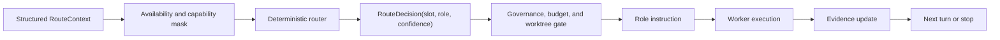

# v0.36.20 Coordinator Foundation

This document records the v0.36.20 coordinator foundation. It is an internal
engineering contract, not a public promise that the router is enabled by
default.

## Release Scope

v0.36.20 introduces the deterministic routing substrate needed before future
benchmark and GA work:

- `TASK-598`: parent release goal for coordinator foundation.
- `TASK-599`: versioned Structured RouteContext and privacy mask.
- `TASK-600`: deterministic router and safe shadow trace.
- `TASK-601`: Thinker, Worker, and Verifier role contracts.
- `TASK-602`: offline evaluator and baseline report path.

Manual dispatch remains the user-facing path. The v0.36.20 router can produce
shadow decisions and trace records, but it does not replace existing pane
dispatch, merge, release, review, or approval behavior.

## Non-Goals

- no learning router
- no online training
- no live provider calls from the evaluator
- no recursive delegation
- no automatic merge or release decision
- no storage of raw prompts, secrets, local private paths, or provider hidden
  metadata in RouteContext or route traces

## Data Flow

## RouteContext

RouteContext is versioned with `schema_version = 1` and
`policy_revision = v03620`. It carries task metadata, read and write scope,
slot readiness and capability metadata, previous route outcomes, bounded turn
budget, and explicit constraints.

The context builder keeps privacy boundaries first. Raw prompt material is not
stored. Absolute local paths are reduced to redacted local-path markers. Secret
strings and provider request metadata are not accepted into the context.

## Deterministic Router

The deterministic router applies masks before scoring:

- exclude unavailable or offline slots
- exclude role mismatches
- exclude write-scope conflicts
- avoid repeating the same failed route unless the prior failure was
  infrastructure
- require review or verification capability for Verifier decisions

The decision is explainable and includes excluded slots, reasons, considered
slots, selected role, selected slot, and confidence. The router records a shadow
route action only; it cannot dispatch, merge, or release.

## Role Contracts

Thinker is read-only and may decompose, hypothesize, and plan.

Worker may implement or experiment only within the assigned route scope and
must return changed files and verification evidence.

Verifier may inspect, run tests, compare evidence, and return ACCEPT or REJECT,
but it must not make product writes.

## Offline Evaluator

The offline evaluator compares:

- deterministic capability router
- strongest single slot
- round robin
- seeded random
- static task-type rule

Metrics include success rate, coordination turns, conflict rate, fallback rate,
and a hard `provider_calls = 0` invariant. This keeps default CI independent of
live providers and API keys.

## Release Gate

The v0.36.20 release is not complete until the static coordinator gate,
Pester wrapper, public-surface audit, release notes, GitHub Release, and
post-release smoke all pass. GitHub Release publication is part of the 100%
condition, not an optional follow-up.

## Decision Record

Status: accepted for v0.36.20 shadow foundation.

Decision: add Structured RouteContext, deterministic routing, role contracts,
shadow RouteTrace, and an offline evaluator as adjacent coordinator substrate.

Consequence: future releases can compare routing strategies without changing
default pane behavior. Live routing, learning, recursive delegation, and
release authority remain out of scope until a later release explicitly changes
those contracts.
