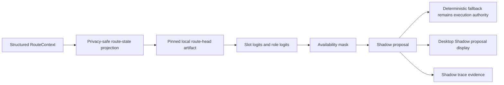

# v0.36.21 Local Router Shadow Mode

This document records the v0.36.21 local router Shadow Mode foundation. It is
an impact-free evaluation layer. It is not a live routing authority and it is
not a benchmark result.

## Release Scope

v0.36.21 adds a fixed local route-head artifact that can score the existing
Structured RouteContext from v0.36.20 and produce Shadow Mode evidence:

- `TASK-603`: parent release goal for the local small router lane.
- `TASK-604`: RouterAdapter boundary, artifact hash pinning, provenance, and
  constrained runtime profile.
- `TASK-605`: privacy-safe route-state projection and lightweight slot/role
  inference.
- `TASK-606`: availability mask, confidence, margin, and deterministic fallback.
- `TASK-607`: prompt fixture evaluation, determinism checks, and logit snapshot
  tests.
- `TASK-608`: Windows CPU/GPU resource and privacy boundary checks.
- `TASK-609`: Tauri Shadow proposal display, release gate, GitHub Release,
  post-release smoke, and branch cleanup.

Shadow Mode only: this release adds proposal and evidence surfaces only.
Manual dispatch remains the user-facing path. The Shadow proposal can be shown
in the desktop UI and written as evidence, but it cannot start workers, change
pane assignment, merge, release, or override the deterministic fallback.

## Non-Goals

- no provider calls
- no online training
- no automatic artifact update
- no hidden network dependency
- no replacement of existing pane dispatch
- no raw prompt storage
- no storage of raw prompts, secrets, local private paths, or provider request
  metadata
- no claim that this is a Harness Bench or live-provider quality measurement

## Data Flow

## Artifact Contract

The local route-head artifact is split into:

- `winsmux-core/router/local-small-router-v03621.manifest.json`
- `winsmux-core/router/local-small-router-v03621.weights.json`

The manifest pins the weights by SHA256 and records provenance, license,
runtime limits, and safety flags. Runtime loading fails closed when:

- the manifest policy revision is not `v03621`
- the weights hash does not match the manifest
- provider calls are allowed
- automatic updates are allowed
- raw prompt storage is allowed

The artifact is repository-authored and deterministic. It is intentionally small
so CI can validate it without downloading a model or contacting a service.

## Shadow Decision Contract

`Invoke-WinsmuxLocalRouterShadow` returns:

- `slot_logits` for the six worker slots in the provided context
- `role_logits` for `Thinker`, `Worker`, and `Verifier`
- `availability_mask` that removes unavailable, offline, setup-required, or
  role-incompatible slots from proposal selection
- `proposal` with slot, role, confidence, margin, and
  `shadow_proposal_only`
- `fallback_decision` from the v0.36.20 deterministic router
- `final_authority` copied from the deterministic fallback
- `provider_calls = 0`

The proposal is evidence only. The deterministic fallback remains the execution
authority even when the Shadow confidence is high.

## Privacy Boundary

The feature projection uses only sanitized RouteContext fields such as role,
task type, scope counts, remaining turn budget, previous failure presence, slot
count, and priority. It does not retain raw prompt text. It does not store API
keys, provider request identifiers, raw local paths, or provider hidden
metadata.

## Release Gate

The v0.36.21 release is not complete until the static router gate, Pester tests,
public-surface audit, release notes, GitHub Release, post-release smoke, and
branch cleanup all pass. GitHub Release publication and post-release smoke are
part of the 100% condition, not optional follow-up work.

## Decision Record

Status: accepted for v0.36.21 Shadow Mode foundation.

Decision: add a pinned local route-head artifact and Shadow Mode evaluation
beside the v0.36.20 deterministic router.

Consequence: future releases can compare local routing signals before Harness
Bench and GA candidate work without changing default worker execution.
