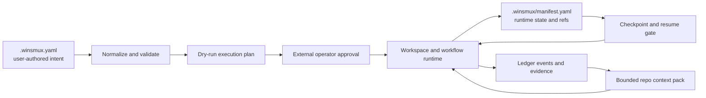

# v0.36.29 Declarative Workspace and Resumable Workflow Architecture

This document is the foundation contract for TASK-658 through TASK-662. It
defines how reusable workspace recipes, resumable workflows, and bounded
repository context packs extend the current winsmux operator and evidence
model. It does not implement those child tasks and does not replace the
existing one-shot operator flow.

## 1. Architectural position

The control chain remains the one defined in `docs/operator-model.md`:

`User -> external operator -> managed pane agents`

The operator remains responsible for decomposition, dispatch approval, review
interpretation, escalation, and final judgement. Declarative configuration may
prepare a workspace and advance an operator-approved workflow, but it must not
turn a recipe, preset, worker, or gate into an independent approval authority.

The new layer is additive:



The implementation must extend these concrete contracts rather than create a
parallel control plane:

- `docs/operator-model.md` defines the operator/pane responsibility boundary,
  evidence-based verification, Context Capsule v1, Checkpoint package v1, and
  the prohibition on raw transcripts and private paths.
- `winsmux-core/scripts/settings.ps1` owns legacy project setting
  normalization and block-style serialization of its owned keys. Project
  saves pass the original document, desired owned-key document, and finite
  owned-key list to the hidden Rust `project-settings-render` boundary, then
  atomically replace the file only after that boundary succeeds.
- The Rust settings renderer uses lossless syntax-tree ranges as a read-only
  edit plan and `serde_yaml` as the single semantic parser and preservation postcondition.
  It preserves Lane A and unknown top-level subtrees, including standard flow
  style, comments, and formatting, while rejecting any candidate that changes
  their meaning. `core/src/operator_cli.rs` and `core/src/workspace_recipe.rs`
  remain the semantic validator and planner for `workspace-recipes`. The
  `winsmux workspace-plan --json` output is the normalized contract consumed
  by future PowerShell runtime paths; PowerShell must not reparse a recipe.
- `winsmux-core/scripts/orchestra-start.ps1` owns workspace startup and
  `Save-OrchestraSessionState`; `winsmux-core/scripts/orchestra-layout.ps1`
  owns the current deterministic pane layout.
- `winsmux-core/scripts/manifest.ps1` owns the PowerShell serialization of the
  current `session`, `panes`, `tasks`, and `worktrees` runtime sections.
- `core/src/manifest_contract.rs` defines `WinsmuxManifest`,
  `ManifestSession`, `ManifestPane`, and `NormalizedManifestPane`, which feed
  the Rust read model.
- `winsmux-core/scripts/team-pipeline.ps1` is the existing operator-mediated
  plan/build/verify loop. Resumable execution wraps or evolves this path; it
  must not introduce a second, behaviorally different dispatch loop.
- `core/src/ledger.rs` builds verification evidence, the context budget
  contract, Context Capsule v1, and Checkpoint package v1. Repository context
  packs extend those evidence references and privacy rules.
- `docs/project/v03622-context-continuity.md` fixes the current recovery
  behavior: invalid or stale capsules are not routable, mailbox delivery is
  idempotent, restore discovery is enumerate-only, and completed work is not
  automatically resumed.

## 2. Sources of truth and lifecycle

There are three separate sources of truth. They must not be collapsed into one
file or inferred from one another after execution starts.

| Layer | Source of truth | Responsibility |
| --- | --- | --- |
| User intent | `.winsmux.yaml` | Versioned recipes, workflow definitions, bounded context-pack policies, and Lane B team/slot settings. |
| Effective runtime | `.winsmux/manifest.yaml` plus run-scoped state under `.winsmux/` | The normalized recipe selection, resolved slot bindings, workflow node state, idempotency records, checkpoint refs, and cleanup/rollback journal for the active run. |
| Verification history | Existing ledger events and evidence refs | Attributable checks, review state, context-pack refs, decisions, and resume evidence. |

`.winsmux.yaml` is declarative intent, not a live workflow journal. A resume
operation uses the persisted normalized snapshot and config fingerprint from
the run manifest. If the current config has a different fingerprint, resume
must stop for an operator decision or start a new run; it must not silently
reinterpret completed nodes using new configuration.

`.winsmux/manifest.yaml` remains generated runtime state. Users and migration
tools must not treat it as the authoring surface. Large context-pack bodies,
raw tool output, and command output do not belong in the manifest; the manifest
stores bounded metadata and durable evidence references.

## 3. Declarative data model

### 3.1 Shared `.winsmux.yaml` boundary with Lane B

Lane A and Lane B share the physical `.winsmux.yaml` file but own disjoint
logical namespaces.

| Namespace | Owner | May contain | Must not contain |
| --- | --- | --- | --- |
| `team-profile`, `agent-slots` | Lane B, especially TASK-713/TASK-715 | Slot identity, provider, model, reasoning effort, role profile, lifecycle, task classes, and provider capability settings. | Workspace geometry, workflow DAG state, context-pack content, or run checkpoints. |
| `workspace-recipes`, `workflows`, `context-packs` | Lane A, TASK-658/TASK-660 | Pane geometry, logical workflow roles, slot/capability references, worktree policy, typed startup actions, DAG nodes, resume/cleanup policy, and bounded repository projections. | Provider/model assignment, secrets, prompt bodies, raw transcripts, or a copy of `agent-slots`. |

Resolution order is fixed:

1. Lane B normalizes `team-profile` and `agent-slots` into the effective slot
   catalog.
2. Lane A compiles workflow actions into per-pane capability requirements,
   combines them with recipe and selector requirements, and only then resolves
   and validates recipe bindings against that catalog.
3. A recipe or workflow action may require a provider capability or refer to
   `slot_id`; neither may
   override a slot's provider, model, reasoning effort, role profile,
   lifecycle, or task classes.
4. The dry-run output shows the resolved slot and its normalized actual
   capability tuple for every logical recipe role.
   A missing, ambiguous, unavailable, or capability-incompatible binding fails
   closed before pane creation.

This boundary prevents two sources of truth for worker assignment. Until Lane
B lands, Lane A uses the effective slots already produced from current
`agent-slots`; future Lane B fields are optional inputs, not a prerequisite for
parsing Lane A configuration. TASK-662 cannot declare the v0.36.29 release
gate complete until TASK-718 has verified the combined desktop/CLI behavior.

### 3.2 Schema sketch

Public YAML uses the repository's existing hyphenated spelling; normalized
runtime objects use snake_case. The following is a valid configuration fragment;
the ownership, reference, and fail-closed rules are normative.

```yaml
config-version: 1

# Lane B-owned; shown only to make the reference boundary explicit. The selected
# preset supplies the remaining resolved slots with concrete provider/model IDs.
team-profile:
  schema-version: 1
  preset: official-balanced-v1
  preset-revision: 1
  update-policy: retain-overrides
agent-slots:
  - slot-id: worker-1
    provider: codex
    model: codex-gpt-5-6-sol

# Lane A-owned.
workspace-recipes:
  bugfix-two-slot:
    schema-version: 1
    panes:
      - pane-key: implement
        workflow-role: implementer
        slot-ref: worker-1
        requires-capabilities: [file-edit]
        region: main
        worktree:
          mode: managed
          name-template: "{{workflow-id}}-implement"
      - pane-key: verify
        workflow-role: verifier
        slot-selector:
          requires-capabilities: [review]
        region: side
        worktree:
          mode: read-only-reference
    startup-actions:
      - action-id: prepare-implement-worktree
        kind: ensure-managed-worktree
        pane-ref: implement
      - action-id: start-verify-slot
        kind: ensure-slot-ready
        pane-ref: verify

workflows:
  bugfix:
    schema-version: 1
    recipe-ref: bugfix-two-slot
    task-input:
      source: runtime-task-file
      privacy: digest-only
    nodes:
      - node-id: inspect
        pane-ref: implement
        action: operator-dispatch
        idempotency-key: "{{run-id}}:inspect"
        cleanup: retain
      - node-id: implement
        pane-ref: implement
        depends-on: [inspect]
        action: operator-dispatch
        idempotency-key: "{{run-id}}:implement"
        cleanup: retain
      - node-id: verify
        pane-ref: verify
        depends-on: [implement]
        action: verification
        context-pack-ref: review-pack
        idempotency-key: "{{run-id}}:verify"
        cleanup: retain
    resume-policy:
      mode: operator-confirmed
      reject-completed-runs: true
    cleanup-policy:
      mode: compensating-actions
      on: [success, failure, cancel]
      actions: [release-run-lock]

context-packs:
  review-pack:
    schema-version: 1
    include: [code-map, changed-files, tests, evidence-refs]
    limits:
      max-files: 100
      max-bytes: 262144
      max-evidence-refs: 50
    privacy:
      raw-transcript: false
      prompt-bodies: false
      secrets: false
      private-local-paths: false
```

Normative field rules:

- Every definition has an independent `schema-version`. Adding these
  contracts does not require changing the current top-level manifest version
  from `1` or invalidating current `.winsmux.yaml` files.
- IDs are stable ASCII identifiers and unique within their containing map.
- `slot-ref` is an exact Lane B slot reference. `slot-selector` is a
  deterministic capability constraint and must produce exactly one effective
  slot from the configured effective slot catalog. TASK-658 does not use live
  pane readiness as an availability signal. `slot-ref` and `slot-selector` are
  mutually exclusive.
- The TASK-658 capability vocabulary is closed: `file-edit` requires
  `supports_file_edit`; `review` requires both `supports_verification` and
  `supports_structured_result`. Pane, selector, and selected workflow-action
  requirements are combined and de-duplicated before matching. Workflow actions
  are not authorized from recipe declarations alone: the resolved slot's actual
  capability tuple is serialized into the normalized application contract and
  checked again by runtime.
- `workflow-role` is a role in this workflow only. It is not Lane B's persistent
  slot `role_profile` and cannot rewrite it.
- Apply-ready schema version 1 supports 1 to 12 physical panes. Unique `region`
  values form equal-width columns in first occurrence order; panes that share a
  region form equal-height rows in pane declaration order. The Rust planner emits
  this concrete ordered `application_layout`; PowerShell applies it without
  interpreting raw region names.
- Resolved physical slot bindings are injective in apply-ready schema version 1.
  Workflows that reuse one agent for several nodes reuse one pane key instead of
  declaring several physical panes for one slot. Physical pane labels and manifest
  `slot_id` values are the resolved Lane B slot IDs. `workflow-role` remains
  workflow-only metadata; Lane B remains authoritative for runtime role, provider,
  model, backend, and other launch settings.
- Startup actions are a closed typed enum with schema-validated arguments.
  TASK-658 accepts exactly `ensure-managed-worktree` and `ensure-slot-ready`.
  Arbitrary shell text, unknown fields, inline credentials, and provider prompt
  bodies are not valid startup actions.
- The schema version 1 startup schedule has two non-interleaved phases. Every
  managed pane has exactly one `ensure-managed-worktree` in the first phase, and
  read-only-reference panes have none. Every pane has exactly one
  `ensure-slot-ready` in the second phase. Missing, duplicate, incompatible, or
  out-of-order coverage is rejected before plan output.
- TASK-659 v1 accepts one workflow task-input contract:
  `source: runtime-task-file` plus `privacy: digest-only`. Declarative start and
  resume require `--task-file <path>`; runtime reads that file exactly once as
  BOM-free UTF-8, rejects NUL and input larger than 262144 bytes, and uses the same
  bytes for all eligible nodes in that invocation. The operator supplies identical
  task bytes for resume. Runtime stores only SHA-256 and byte count in the run state;
  it never stores the task/prompt body or private task-file path. A missing task or
  digest/length mismatch rejects resume before any side effect. Every
  `operator-dispatch` node sends that runtime task through the existing guarded
  team-pipeline dispatch path; every `verification` node uses the same existing
  verification path with dependency evidence refs. Node-specific freeform payloads
  and inline shell are not supported.
- Node `cleanup` is required and accepts only `retain` in TASK-659 v1. It records
  that the external dispatch/verification effect is not automatically reversible;
  rollback never guesses how to undo it. `cleanup-policy.actions` is a closed list
  containing only `release-run-lock`. That action has no user arguments: runtime
  derives the lock path beneath `.winsmux/workflow-runs/` from the validated run ID
  and executes it only when the lock payload matches the run ID, manifest generation
  ID, config fingerprint, and source head. Unknown actions, arbitrary paths, shell
  text, missing ownership evidence, and mismatches become `blocked` without removal.
  All run-state and lock paths are derived by one runtime owner. The `.winsmux`,
  `workflow-runs`, run directory, `state.json`, and `run.lock` components are checked
  before access; any observed reparse point is rejected rather than followed outside
  the managed project boundary.
- Worktree paths are derived by runtime policy. Config may provide a safe name
  template but not an absolute private path or an escape outside the managed
  worktree root.
- A managed pane uses `.worktrees/<normalized-name>` and branch
  `worktree-<normalized-name>`. Runtime rejects all path, branch, registration,
  reparse-point, and cardinality conflicts before effects. A read-only-reference
  pane starts in the project root and creates no worktree; this mode does not claim
  operating-system write isolation. Declarative rollback never force-removes a
  worktree. Before any slot starts, cleanup removes only an exactly registered,
  clean, unchanged worktree created by the current invocation. After a slot starts,
  or when path, branch, gitdir, HEAD, or cleanliness differs, it preserves the
  worktree for operator handling.
- DAG dependencies must be acyclic. Each side-effecting node has a stable
  idempotency key and an explicit compensation or cleanup classification.
- Context-pack `include` values are allowlisted projections. Omitted limits use
  conservative defaults; disabling privacy exclusions is not supported.

Recipe selection is explicit. The TASK-658 preview entry point is
`winsmux workspace-plan --recipe-id <id> [--workflow-id <id>] --json
--project-dir <path>`. Merely adding `workspace-recipes` does not select a
recipe or alter startup. A `{{workflow-id}}` template requires the explicit
`--workflow-id` value; recipe IDs are never substituted for missing workflow
identity. Preview normalizes and validates the complete selected recipe before
returning deterministic JSON and does not create logs, evidence, temporary
files, manifests, processes, panes, branches, directories, or worktrees.

### 3.3 Runtime manifest projection

TASK-658 and TASK-659 add optional versioned sections to the existing
`.winsmux/manifest.yaml` instead of replacing `session`, `panes`, `tasks`, or
`worktrees`:

```yaml
declarative_workspace:
  schema_version: 1
  config_fingerprint: sha256:...
  recipe_id: bugfix-two-slot
  resolved_bindings:
    implement: worker-1
    verify: worker-2
  dry_run_plan_ref: evidence:...

workflow_runs:
  run-123:
    schema_version: 3
    workflow_id: bugfix
    state: blocked
    config_fingerprint: sha256:...
    source_head: 0123456789abcdef...
    task_sha256: sha256:...
    task_byte_count: 1234
    resolved_bindings:
      implement: worker-1
      verify: worker-2
    application_contract:
      implement:
        pane_ref: implement
        slot_id: worker-1
        worktree: { mode: managed, name: bugfix-implement }
        actual_capabilities:
          supports_file_edit: true
          supports_verification: false
          supports_structured_result: false
      verify:
        pane_ref: verify
        slot_id: worker-2
        worktree: { mode: read-only-reference }
        actual_capabilities:
          supports_file_edit: false
          supports_verification: true
          supports_structured_result: true
    pane_head_leases:
      implement:
        base_head: 0123456789abcdef...
        admitted_head: fedcba9876543210...
    nodes:
      inspect:
        state: succeeded
        attempt: 1
        idempotency_key: run-123:inspect
        agent_cli_session_id: opaque-local-routing-id
        execution_lease:
          pane_ref: implement
          slot_id: worker-1
          worktree_mode: managed
          input_head: 0123456789abcdef...
        application_outcome:
          input_head: 0123456789abcdef...
          output_head: fedcba9876543210...
        completion_proof:
          schema_version: 2
          input_head: 0123456789abcdef...
          output_head: fedcba9876543210...
        evidence_refs: [evidence:...]
      verify:
        state: blocked
        attempt: 1
        checkpoint_ref: checkpoint:...
    cleanup_journal:
      - action_id: release-run-lock
        kind: release-run-lock
        state: succeeded
        idempotency_key: run-123:cleanup:release-run-lock
        resource_ref: workflow-run-lock:run-123
    rollback_state: not_requested
    context_pack_refs: [context-pack:...]
```

The PowerShell writer in `winsmux-core/scripts/manifest.ps1` currently emits a
fixed section set, so child implementation must preserve unknown additive
sections on read/write and add focused round-trip tests. The Rust
`WinsmuxManifest`/`NormalizedManifestPane` path must continue to accept a
manifest containing these sections even before every consumer uses them.

Runtime values are projections, not re-parsed intent:

- pane entries receive resolved slot, workflow role, worktree reference, task
  identity, capabilities, and current state;
- workflow entries receive the normalized application contract and actual
  capability tuple, normalized DAG, per-pane admitted-HEAD ledger, node
  execution leases and outcomes, attempts, idempotency records, checkpoint
  refs, and cleanup journal;
- ledger events receive state transitions and attributable evidence refs;
- context packs receive public repository-relative refs and digests only;
- Context Capsule and Checkpoint package receive the context-pack ref and
  freshness/config fingerprint needed to judge safe resume.

## 4. Resumable workflow state model

A workflow run has an explicit state: `planned`, `ready`, `running`, `blocked`,
`failed`, `cleanup_pending`, `succeeded`, `cancelled`, or `rolled_back`. A node
has `pending`, `ready`, `dispatching`, `running`, `blocked`, `failed`,
`succeeded`, `cleanup_pending`, `cleaned`, or `rolled_back`.

State transitions are driven by structured runtime results and recorded
acknowledgements, never by sniffing pane text for success words. Dispatch
success requires a closed mailbox v2 completion envelope. `operator-poll.ps1`
must validate that envelope against the current pane/generation and project it
as one immutable schema-version 2 run-owned proof, including exact `input_head`
and operator-observed `output_head`, under
`.winsmux/workflow-runs/<run>/proofs/` before the workflow consumes it. The
mailbox pending directory is transport
only, and active or rotated logs are observability only; neither TTL nor log
retention may grant or revoke completion authority. A process exit, successful
pane write, `STATUS: EXEC_DONE`, or `VERIFY_PASS` text is not sufficient proof.

For every side effect, runtime must persist the transition intent and
idempotency key before dispatch and persist the acknowledgement/evidence before
unlocking dependent nodes. On restart:

1. load and validate the manifest and ledger evidence;
2. verify the workflow schema version, workflow fingerprint, config
   fingerprint, actual project `HEAD`, slot bindings, checkpoint freshness, and
   privacy gate;
3. reconcile `dispatching` or `running` nodes with durable mailbox
   acknowledgements and the current session registry; pane status text is not
   completion evidence;
4. skip nodes whose matching idempotency record is already `succeeded`;
5. surface ambiguous work as `blocked` for operator judgement;
6. resume only unfinished nodes after explicit operator confirmation; and
7. reject automatic resume of `succeeded`, `cancelled`, or `rolled_back` runs.

Each dispatch first persists an immutable execution lease containing the pane
reference, resolved slot, worktree mode, and exact input `HEAD`. The project
source `HEAD` remains immutable confirmation authority for read-only-reference
applications. A managed application may publish only the same commit or a Git
descendant of its leased input; after the operator verifies that relation, the
reducer atomically records the node outcome and advances that pane's admitted
`HEAD`. Later nodes resolve their input from the per-pane ledger rather than
requiring every managed worktree to stay at the run's original source commit.
A succeeded producer needed by unfinished verification must retain its exact
path and admitted `HEAD`, but its old live pane lease is not restored.

Operator confirmation is bound to the exact run ID, manifest generation ID,
config fingerprint, and source head observed by the operator. Before any run
state mutation, runtime independently observes the actual project `HEAD` and
requires an exact full-SHA match. The normalized workflow fingerprint is stored
with the run and rechecked on resume, independently of the broader config
fingerprint. A stale or partial confirmation is not reusable authority. TASK-659
v1 does not automatically retry a failed dispatch: `attempt` and the stable node
`idempotency_key` are persisted before the first dispatch, and a failed attempt
requires a new operator-approved run rather than a second submission for the same
node key.

An optional node-level `agent_cli_session_id` is the persistent thread/session
routing identity used for resume. It is local opaque metadata, not provider hidden
metadata: runtime may set it only from a validated structured acknowledgement or a
current session-registry record, never by deriving it from pane text or inventing a
replacement. Once set, it is immutable for that node and run. An in-flight node with
a missing, changed, or conflicting identity becomes `blocked`; resume does not create
  a new provider thread. The value stays in local runtime state and the local
  structured acknowledgement evidence needed for reconciliation; it is not copied
  into configuration, public evidence, or review prompts.

Declarative mode is selected only when the first argument after `pipeline` or its
`task-run` alias is exactly `--workflow-action`. This preserves all existing
positional task text, including a later literal `--workflow-action`, as legacy input.
The closed v1 command forms are:

```text
winsmux pipeline --workflow-action start --recipe-id <id> --workflow-id <id> \
  --run-id <id> --generation-id <id> --config-fingerprint <sha256:...> \
  --source-head <full-commit-id> --task-file <path> [--project-dir <path>] --json
winsmux pipeline --workflow-action resume --run-id <id> --generation-id <id> \
  --config-fingerprint <sha256:...> --source-head <full-commit-id> \
  --task-file <path> [--project-dir <path>] --json
```

The four confirmation values are validated as one indivisible tuple before any
manifest transition. Start invokes `workspace-plan` exactly once and reuses its one
strict JSON object for validation, snapshot, and DAG construction. Resume loads the
persisted normalized snapshot as execution truth and invokes `workspace-plan` once
only to compare current fingerprint/bindings; it does not reinterpret the in-flight
run from changed config. Unknown, duplicate, missing, or positional declarative
arguments, nonzero plan exit, malformed or extra stdout, and tuple mismatch reject
before mutation. Declarative stdout is exactly one versioned JSON object with CLI
status `accepted`, `blocked`, `rejected`, or `failed`; only `accepted` exits zero.
Legacy output and exit behavior are unchanged.

Cleanup is a journaled sequence of typed compensating actions. Each action has
its own idempotency key and terminal status, so interruption during cleanup is
resumable without repeating a completed destructive action. Rollback means
running those declared compensations in reverse dependency order; it does not
mean `git reset --hard`, deleting an unverified worktree, or undoing external
effects that the workflow never declared.

Cleanup action state is one of `pending`, `running`, `blocked`, `succeeded`, or
`failed`. Runtime persists the action intent and idempotency key before execution. If
the effect may have occurred but terminal evidence is absent, the action becomes
`blocked` and is not automatically repeated; an already `succeeded` action is always
skipped. Terminal `succeeded`, `failed`, and `cancelled` outcomes invoke the same
cleanup choke point. Cleanup preserves that original terminal outcome while its
separate journal records success or a blocking ambiguity; a later resume completes
only a still-safe pending cleanup action and never repeats a succeeded action.

## 5. Repository context pack

The repository context pack is a bounded projection layered on the context
budget contract in `core/src/ledger.rs`. It is not a transcript summary and is
not a replacement for Context Capsule v1 or Checkpoint package v1.

Required projection groups are:

- `code_map`: repository-relative modules or symbols selected by deterministic
  rules, with source head and optional digests;
- `changed_files`: public repository-relative paths and bounded diff summaries,
  reusing the current `public_changed_files` privacy behavior;
- `tests`: check identifiers, commands when public-safe, outcomes, timestamps,
  and evidence refs rather than raw output;
- `evidence_refs`: allowlisted durable refs already attributable through the
  ledger; and
- `freshness`: source head, config fingerprint, creation time, limits applied,
  omissions, and redaction counts.

Generation is deterministic for the same source head, policy, and evidence
set. When a limit is reached, the pack reports truncation and omitted counts;
it does not silently exceed the budget. The pack is invalid if it contains a
raw terminal transcript, prompt body, secret, credential material, provider
hidden metadata, an absolute private path, or a reference outside the allowed
project/evidence namespaces.

The manifest stores only pack ID, schema version, digest, freshness, limits,
and durable reference. The ledger's context contract carries the ref and the
summary quality/privacy result. A stale, invalid, source-head-mismatched, or
over-budget pack is not routable and cannot authorize resume.

## 6. Child task contracts

Each child is a separate implementation and PR unit. A child may use fixtures
for later contracts, but it must not absorb another child's production scope.
The merge order remains TASK-658, TASK-659, TASK-660, TASK-661, then TASK-662.

### 6.1 TASK-658: workspace layout and recipe definitions

**Owns:** the Lane A `.winsmux.yaml` schema and normalization for
`workspace-recipes`; logical pane geometry; workflow-role-to-slot references;
capability validation; managed-worktree policy; the closed startup-action
enum; dry-run workspace planning; and projection of the selected recipe and
resolved bindings into the runtime manifest.

**Does not own:** provider/model/reasoning assignment, `team-profile`,
`agent-slots`, workflow execution state, context-pack generation, presets, or
desktop release parity.

**Acceptance gate:**

- standard YAML spellings normalize through the single Rust reader, while the
  PowerShell settings writer emits only its owned block-style draft and the
  Rust renderer losslessly preserves Lane A and unknown YAML with a semantic
  postcondition before the atomic project-file replacement;
- duplicate IDs, unknown actions, path escapes, ambiguous selectors, missing
  slots, and capability mismatches fail before pane/worktree creation;
- existing `.winsmux.yaml` files without Lane A keys produce the current
  layout and startup behavior unchanged;
- Lane B-owned fields survive normalization and manifest projection without
  being copied into Lane A definitions;
- dry-run emits a deterministic, secret-free plan containing resolved slots,
  pane geometry, worktrees, startup actions, and zero side effects; and
- manifest round-trip preserves both existing and additive sections.

### 6.2 TASK-659: resumable workflow and pipeline

**Owns:** workflow DAG validation; the run/node state machines; dependency
release; persisted idempotency records; operator-confirmed resume; structured
dispatch acknowledgement; retry accounting; checkpoint reconciliation;
journaled cleanup; and declared rollback. It evolves or wraps
`winsmux-core/scripts/team-pipeline.ps1` so the current pipeline remains the
single dispatch behavior.

**Does not own:** recipe parsing beyond consuming TASK-658's normalized plan,
repository context selection, gallery content, or final desktop/CLI parity.

**Acceptance gate:**

- cyclic or missing dependencies fail before dispatch;
- workflow action requirements participate in slot selection, and both compile
  time and runtime reject capability or worktree-policy mismatch against the
  persisted application contract;
- an interruption is simulated at every side-effect boundary and resume
  continues only unfinished nodes;
- managed node input/output commits form a verified per-pane chain, while
  read-only verification cannot publish a changed `HEAD`;
- repeating the same idempotency key cannot repeat a completed side effect;
- ambiguous `dispatching`/`running` state becomes `blocked`, not guessed
  success or failure;
- cleanup can itself be interrupted and resumed, and each compensation runs at
  most once;
- completed/cancelled/rolled-back runs reject automatic resume; and
- the existing non-declarative team pipeline still passes its focused tests
  and uses the same operator approval/review boundaries.

### 6.3 TASK-660: repository context package

**Owns:** the `context-packs` schema; deterministic `code_map`, changed-file,
test, and evidence-ref projections; byte/item budgets; freshness and source-head
checks; redaction; pack digests; and integration with the existing ledger
context contract, Context Capsule, and Checkpoint package.

**Does not own:** raw transcript capture, general-purpose repository indexing,
prompt storage, provider memory, workflow state transitions, or preset UX.

**Acceptance gate:**

- identical public inputs produce the same digest and bounded ordering;
- every projection enforces file, byte, and reference limits and reports
  truncation/omissions;
- synthetic secrets, absolute private paths, prompt bodies, raw transcripts,
  and refs outside allowlisted namespaces are rejected or redacted with a
  failing privacy result where required;
- changed files and tests remain attributable to source head and evidence refs;
- stale/source-mismatched/invalid packs are not routable and cannot satisfy a
  resume gate; and
- context-pack metadata round-trips without persisting raw diff/tool output in
  `.winsmux/manifest.yaml`.

### 6.4 TASK-661: templates, gallery, and migration path

**Owns:** four public presets (`bugfix`, `review`, `research`, `benchmark`),
examples and gallery metadata, schema validation for shipped presets, and an
explicit preview/apply migration path from current operator settings to Lane A
declarations.

**Does not own:** new execution semantics, provider/model pins, rewriting Lane
B team profiles, silent config mutation, or removal of the current operator
flow.

**Acceptance gate:**

- all four presets validate against TASK-658/TASK-659/TASK-660 contracts and
  contain no secrets, private paths, provider-specific model pins, or prompt
  bodies;
- preset selection resolves through capabilities/slot refs and produces a
  deterministic dry-run;
- migration preview is side-effect free and reports additions, preserved
  fields, unsupported inputs, and rollback instructions;
- apply is explicit, creates a reversible backup or equivalent atomic replace,
  preserves Lane B-owned and unknown compatible fields, and is idempotent; and
- users may continue the existing operator flow without migrating.

### 6.5 TASK-662: workflow pre-release gate

**Owns:** the aggregate release gate for declarative workflows: dry-run purity,
rollback/cleanup recovery, interruption/resume, docs/examples, public-surface
audit, and desktop/CLI parity. It also verifies the combined Lane A/Lane B
config after TASK-718.

**Does not own:** feature implementation hidden inside gate code, weakening
tests to obtain a pass, GitHub Release publication without the separate release
approval, or automatic merge/release authority.

**Acceptance gate:**

- CLI and desktop load the same config fixture and report the same normalized
  recipe, workflow, resolved slots, context-pack metadata, run state, and
  blocking reasons;
- dry-run proves no panes, worktrees, messages, workflow state, or cleanup
  actions were mutated;
- restart tests cover interruption before dispatch, after dispatch/before ack,
  after ack/before dependent release, during cleanup, and after terminal state;
- rollback evidence identifies each declared compensation and proves completed
  compensations are not repeated;
- legacy/no-Lane-A configuration passes regression coverage;
- all shipped presets and migration examples are schema-checked in CI;
- public-surface and privacy scans prove no planning files, raw transcripts,
  secrets, private paths, or internal prompt bodies are exposed; and
- TASK-718's team-profile/agent-slot desktop gate is green before TASK-662 can
  mark the v0.36.29 combined release gate complete.

## 7. Pre-release gate wiring

TASK-662 should expose one aggregate result with separately attributable
sub-gates. A single green unit-test command is not sufficient release evidence.

| Gate | Required evidence | Failure behavior |
| --- | --- | --- |
| Dry-run | Normalized config fingerprint, resolved bindings, planned panes/worktrees/actions, and before/after runtime-state equality. | Fail if any runtime mutation or unresolved binding occurs. |
| Resume | Interruption matrix, checkpoint freshness, source/config match, mailbox reconciliation, and node/idempotency states. | Block for operator decision on stale, ambiguous, terminal, or mismatched state. |
| Rollback/cleanup | Compensation plan, reverse dependency order, per-action idempotency result, and remaining external effects. | Stop on an unsafe/unknown compensation and preserve the journal for resume. |
| Documentation/examples | Schema validation for every documented snippet and all four shipped presets; migration preview/apply/rollback evidence. | Fail on drift between docs, CLI, desktop, or schema. |
| CLI/desktop parity | Golden normalized contract plus equivalent visible state, blocking reasons, and actions from both surfaces. | Fail closed; neither surface may claim the workflow is ready. |
| Compatibility/privacy | Current operator-flow regressions, manifest round-trip, public-surface audit, and bounded-context privacy fixtures. | Preserve the old path and reject unsafe new artifacts. |

The aggregate gate reports `pass`, `fail`, `blocked`, or `not_applicable` per
sub-gate, with evidence refs and a reason. `blocked` is not converted to
`pass`. Desktop rendering is evidence of parity only when the CLI and desktop
consume the same normalized contract, not when their labels merely look
similar.

## 8. Migration, compatibility, and old-path treatment

The current `.winsmux.yaml` keys, default external-operator layout,
`agent-slots` behavior, `orchestra-start.ps1` entrypoint, one-shot
`team-pipeline.ps1` path, and operator-owned decisions are intentionally
preserved.

Lane A keys are opt-in. Absence of `workspace-recipes`, `workflows`, and
`context-packs` selects current behavior. The gallery may generate a proposal,
but no existing project is rewritten until an explicit migration apply.
Unknown incompatible schema versions fail with an actionable error; they do
not fall back to a partially understood workflow.

Rollback for adoption means restoring the prior `.winsmux.yaml` and removing
or archiving the new run-scoped runtime state after safety checks. Runtime
rollback never edits the external planning backlog and never removes a user
worktree merely because a workflow record is incomplete.

## 9. Risks and mitigations

| Risk | Required mitigation |
| --- | --- |
| Lane A and Lane B both redefine slot/provider assignment. | Enforce namespace ownership and resolve Lane B slots before Lane A bindings; add shared cross-lane fixtures. |
| Config changes make an old checkpoint unsafe. | Persist normalized snapshot/config fingerprint and block resume on mismatch. |
| Duplicate dispatch after crash. | Persist intent/idempotency before dispatch and reconcile mailbox acknowledgement before retry. |
| Manifest writers drop new or unknown sections. | Add lossless additive-section round-trip tests to PowerShell and Rust paths. |
| Arbitrary startup actions become a command-injection surface. | Closed action enum, schema-validated arguments, managed-path checks, no inline shell or credentials. |
| Context packs leak private content or grow without bound. | Allowlisted projections, hard limits, public refs, deterministic redaction, and fail-closed privacy gate. |
| Cleanup repeats destructive work. | Journal each compensation with a stable idempotency key and require explicit operator handling for ambiguity. |
| A junction redirects workflow state, mailbox, proof, or lock access outside the project. | Derive every managed path through one owner and reject any observed reparse component before access. This is defense in depth for prepared reparse points, not an arbitrary-code sandbox or a guarantee against a concurrent component swap after validation. |
| Log rotation removes workflow evidence. | Resolve only the exact immutable run-owned proof; logs remain observability and are never a proof fallback. |
| Desktop and CLI implement different semantics. | One normalized contract and golden parity fixtures; UI does not rederive runtime meaning. |
| TASK-662 runs before Lane B is complete. | Allow Lane A-only gate development, but keep the combined release result blocked until TASK-718 evidence is present. |
| Declarative automation weakens operator authority. | Operator-confirmed start/resume/rollback and evidence-based final judgement remain mandatory. |

## 10. Non-goals

- implementing TASK-658 through TASK-662 in this parent task
- replacing the external operator or existing operator/pane responsibility
  boundary
- removing or silently migrating the current layout and one-shot pipeline
- owning Lane B's `team-profile`, `agent-slots`, provider, model, reasoning,
  role-profile, lifecycle, or task-class configuration
- storing raw transcripts, prompt bodies, secrets, credential material,
  provider hidden metadata, raw tool output, or private absolute paths
- using freeform pane text or in-band sentinels as workflow truth
- automatic merge, release, rollback, or destructive worktree cleanup
- general-purpose repository indexing or unbounded long-term agent memory
- changing external planning files as part of workflow execution

## 11. Decision record

Status: foundation design accepted for child implementation.

Decision: extend the existing operator/evidence control plane with additive,
versioned Lane A namespaces in `.winsmux.yaml`, project normalized runtime state
into `.winsmux/manifest.yaml` and ledger evidence, and keep Lane B as the sole
owner of persistent team/slot/provider assignment.

Consequence: TASK-658 through TASK-662 have independent implementation and
verification boundaries, current projects retain their existing behavior, and
the v0.36.29 release can require safe dry-run, resume, rollback, bounded
context, migration, and desktop/CLI parity without creating a second operator
or evidence model.
