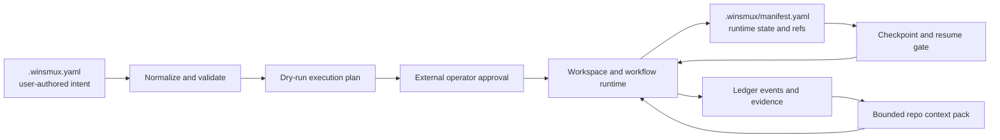

# v0.36.29 Declarative Workspace and Resumable Workflow Architecture

This document is the foundation contract for TASK-658 through TASK-662. It
defines how reusable workspace recipes, resumable workflows, and bounded
repository context packs extend the current winsmux operator and evidence
model. It does not implement those child tasks and does not replace the
existing one-shot operator flow.

## 1. Architectural position

The control chain remains the one defined in `docs/operator-model.md`:

`User -> external operator -> managed pane agents`

The operator remains responsible for decomposition, dispatch approval, review
interpretation, escalation, and final judgement. Declarative configuration may
prepare a workspace and advance an operator-approved workflow, but it must not
turn a recipe, preset, worker, or gate into an independent approval authority.

The new layer is additive:


```mermaid
flowchart LR
    C[".winsmux.yaml\nuser-authored intent"] --> N["Normalize and validate"]
    N --> P["Dry-run execution plan"]
    P --> O["External operator approval"]
    O --> R["Workspace and workflow runtime"]
    R --> M[".winsmux/manifest.yaml\nruntime state and refs"]
    R --> E["Ledger events and evidence"]
    E --> X["Bounded repo context pack"]
    X --> R
    M --> K["Checkpoint and resume gate"]
    K --> R
```

The implementation must extend these concrete contracts rather than create a
parallel control plane:

- `docs/operator-model.md` defines the operator/pane responsibility boundary,
  evidence-based verification, Context Capsule v1, Checkpoint package v1, and
  the prohibition on raw transcripts and private paths.
- `winsmux-core/scripts/settings.ps1` owns legacy project setting
  normalization and block-style serialization of its owned keys. Project
  saves pass the original document, desired owned-key document, and finite
  owned-key list to the hidden Rust `project-settings-render` boundary, then
  atomically replace the file only after that boundary succeeds.
- The Rust settings renderer uses lossless syntax-tree ranges as a read-only
  edit plan and `serde_yaml` as the single semantic parser and preservation postcondition.
  It preserves Lane A and unknown top-level subtrees, including standard flow
  style, comments, and formatting, while rejecting any candidate that changes
  their meaning. `core/src/operator_cli.rs` and `core/src/workspace_recipe.rs`
  remain the semantic validator and planner for `workspace-recipes`. The
  `winsmux workspace-plan --json` output is the normalized contract consumed
  by future PowerShell runtime paths; PowerShell must not reparse a recipe.
- `winsmux-core/scripts/orchestra-start.ps1` owns workspace startup and
  `Save-OrchestraSessionState`; `winsmux-core/scripts/orchestra-layout.ps1`
  owns the current deterministic pane layout.
- `winsmux-core/scripts/manifest.ps1` owns the PowerShell serialization of the
  current `session`, `panes`, `tasks`, and `worktrees` runtime sections.
- `core/src/manifest_contract.rs` defines `WinsmuxManifest`,
  `ManifestSession`, `ManifestPane`, and `NormalizedManifestPane`, which feed
  the Rust read model.
- `winsmux-core/scripts/team-pipeline.ps1` is the existing operator-mediated
  plan/build/verify loop. Resumable execution wraps or evolves this path; it
  must not introduce a second, behaviorally different dispatch loop.
- `core/src/ledger.rs` builds verification evidence, the context budget
  contract, Context Capsule v1, and Checkpoint package v1. Repository context
  packs extend those evidence references and privacy rules.
- `docs/project/v03622-context-continuity.md` fixes the current recovery
  behavior: invalid or stale capsules are not routable, mailbox delivery is
  idempotent, restore discovery is enumerate-only, and completed work is not
  automatically resumed.

## 2. Sources of truth and lifecycle

There are three separate sources of truth. They must not be collapsed into one
file or inferred from one another after execution starts.

| Layer | Source of truth | Responsibility |
| --- | --- | --- |
| User intent | `.winsmux.yaml` | Versioned recipes, workflow definitions, bounded context-pack policies, and Lane B team/slot settings. |
| Effective runtime | `.winsmux/manifest.yaml` plus run-scoped state under `.winsmux/` | The normalized recipe selection, resolved slot bindings, workflow node state, idempotency records, checkpoint refs, and cleanup/rollback journal for the active run. |
| Verification history | Existing ledger events and evidence refs | Attributable checks, review state, context-pack refs, decisions, and resume evidence. |

`.winsmux.yaml` is declarative intent, not a live workflow journal. A resume
operation uses the persisted normalized snapshot and config fingerprint from
the run manifest. If the current config has a different fingerprint, resume
must stop for an operator decision or start a new run; it must not silently
reinterpret completed nodes using new configuration.

`.winsmux/manifest.yaml` remains generated runtime state. Users and migration
tools must not treat it as the authoring surface. Large context-pack bodies,
raw tool output, and command output do not belong in the manifest; the manifest
stores bounded metadata and durable evidence references.

## 3. Declarative data model

### 3.1 Shared `.winsmux.yaml` boundary with Lane B

Lane A and Lane B share the physical `.winsmux.yaml` file but own disjoint
logical namespaces.

| Namespace | Owner | May contain | Must not contain |
| --- | --- | --- | --- |
| `team-profile`, `agent-slots` | Lane B, especially TASK-713/TASK-715 | Slot identity, provider, model, reasoning effort, role profile, lifecycle, task classes, and provider capability settings. | Workspace geometry, workflow DAG state, context-pack content, or run checkpoints. |
| `workspace-recipes`, `workflows`, `context-packs` | Lane A, TASK-658/TASK-660 | Pane geometry, logical workflow roles, slot/capability references, worktree policy, typed startup actions, DAG nodes, resume/cleanup policy, and bounded repository projections. | Provider/model assignment, secrets, prompt bodies, raw transcripts, or a copy of `agent-slots`. |

Resolution order is fixed:

1. Lane B normalizes `team-profile` and `agent-slots` into the effective slot
   catalog.
2. Lane A validates recipe bindings against slot IDs and capabilities from
   that catalog.
3. A recipe may require a provider capability or refer to a YAML `slot-ref`;
   it may not override a slot's provider, model, reasoning effort, role
   profile, lifecycle, or task classes. Runtime objects may expose the resolved
   identity as `slot_id`.
4. The dry-run output shows the resolved slot for every logical recipe role.
   A missing, ambiguous, unavailable, or capability-incompatible binding fails
   closed before pane creation.

This boundary prevents two sources of truth for worker assignment. Until Lane
B lands, Lane A uses the effective slots already produced from current
`agent-slots`; future Lane B fields are optional inputs, not a prerequisite for
parsing Lane A configuration. TASK-662 cannot declare the v0.36.29 release
gate complete until TASK-718 has verified the combined desktop/CLI behavior.

### 3.2 Schema sketch

Canonical `.winsmux.yaml` keys are kebab-case, matching the live product
contract: `team-profile`, `agent-slots`, `workspace-recipes`, `slot-ref`, and
the other hyphenated fields in the fragment below. Snake_case spellings such as
`team_profile` / `agent_slots` are load-only aliases where the live loader
already accepts them (`mapping_lookup` in `core/src/team_profile.rs`, and the
legacy settings loader's hyphen-to-underscore fold). They are not the
canonical on-disk form. Do not reverse live product keys to snake_case.

A scalar `team-profile: default` is not a valid Lane B opt-in. The live parser
requires a mapping and fails closed with "team-profile must be a mapping."
This document does not introduce a scalar migration alias.

Normalized runtime objects, including `.winsmux/manifest.yaml` projections,
may still use snake_case field names. That runtime spelling is not the YAML
settings contract.

Public YAML uses the repository's existing hyphenated spelling; normalized
runtime objects use snake_case. The marker-delimited fragment below is the
current executable workflow schema-version 1 contract. Its exact bytes are
consumed by `core/tests-rs/workflow_contract.rs` through the canonical
workspace/workflow normalizers, so a documented field cannot drift from the
public parser.

<!-- TASK659-RUNNABLE-WORKFLOW-V1:START -->
```yaml
config-version: 1

# Lane B-owned; shown only to make the reference boundary explicit. The selected
# preset supplies the remaining resolved slots with concrete provider/model IDs.
team-profile:
  schema-version: 1
  preset: official-balanced-v1
  preset-revision: 1
  update-policy: retain-overrides
agent-slots:
  - slot-id: worker-1
    provider: codex
    model: codex-gpt-5-6-sol

# Lane A-owned.
workspace-recipes:
  bugfix-two-slot:
    schema-version: 1
    panes:
      - pane-key: implement
        workflow-role: implementer
        slot-ref: worker-1
        requires-capabilities: [file-edit]
        region: main
        worktree:
          mode: managed
          name-template: "{{workflow-id}}-implement"
      - pane-key: verify
        workflow-role: verifier
        slot-selector:
          requires-capabilities: [review]
        region: side
        worktree:
          mode: read-only-reference
    startup-actions:
      - action-id: prepare-implement-worktree
        kind: ensure-managed-worktree
        pane-ref: implement
      - action-id: start-verify-slot
        kind: ensure-slot-ready
        pane-ref: verify

workflows:
  bugfix:
    schema-version: 1
    recipe-ref: bugfix-two-slot
    nodes:
      - node-id: inspect
        pane-ref: implement
        action: operator-dispatch
      - node-id: implement
        pane-ref: implement
        depends-on: [inspect]
        action: operator-dispatch
      - node-id: verify
        pane-ref: verify
        depends-on: [implement]
        action: operator-dispatch
```
<!-- TASK659-RUNNABLE-WORKFLOW-V1:END -->

The current workflow v1 parser derives every node idempotency key as
`<run-id>:<node-id>`; it does not accept an authored `idempotency-key`.
Workflow-level `resume-policy` and `cleanup-policy`, and node-level
`verification` actions or `context-pack-ref`, remain target concepts owned by
later child tasks. They are not executable TASK-659 fields. TASK-660 does not
add a workflow field or route/resume authority.

The following marker-delimited context-pack policy is executable byte-for-byte
through the public, side-effect-free `winsmux workspace-plan` TASK-660 preview.
It remains inert until explicitly selected and is not part of the workflow v1
schema:

<!-- TASK660-RUNNABLE-CONTEXT-PACK-V1:START -->
```yaml
context-packs:
  review-pack:
    schema-version: 1
    include: [code-map, changed-files, tests, evidence-refs]
    limits:
      max-files: 100
      max-bytes: 262144
      max-evidence-refs: 50
    privacy:
      raw-transcript: false
      prompt-bodies: false
      secrets: false
      private-local-paths: false
```
<!-- TASK660-RUNNABLE-CONTEXT-PACK-V1:END -->

Normative field rules:

- Every definition has an independent `schema-version`. Adding these
  contracts does not require changing the current top-level manifest version
  from `1` or invalidating current `.winsmux.yaml` files.
- IDs are stable ASCII identifiers and unique within their containing map.
- `slot-ref` is an exact Lane B slot reference. `slot-selector` is a
  deterministic capability constraint and must produce exactly one effective
  slot from the configured effective slot catalog. TASK-658 does not use live
  pane readiness as an availability signal. `slot-ref` and `slot-selector` are
  mutually exclusive.
- The TASK-658 capability vocabulary is closed: `file-edit` requires
  `supports_file_edit`; `review` requires both `supports_verification` and
  `supports_structured_result`. Pane and selector requirements are combined
  and de-duplicated before matching.
- `workflow-role` is a role in this workflow only. It is not Lane B's persistent
  slot `role_profile` and cannot rewrite it.
- Startup actions are a closed typed enum with schema-validated arguments.
  TASK-658 accepts exactly `ensure-managed-worktree` and `ensure-slot-ready`.
  Arbitrary shell text, unknown fields, inline credentials, and provider prompt
  bodies are not valid startup actions.
- Worktree paths are derived by runtime policy. Config may provide a safe name
  template but not an absolute private path or an escape outside the managed
  worktree root.
- DAG dependencies must be acyclic. TASK-659 derives each side-effecting
  node's stable idempotency key from the public run and node identities;
  authored idempotency, compensation, and cleanup fields are not workflow v1
  inputs.
- TASK-660 context-pack `include` values are allowlisted projections. Omitted
  limits use conservative defaults; enabling any privacy escape is rejected.
  The closed input schema accepts only attributable repository-relative
  identities and safe evidence refs, never free-form content. Every admitted
  repository-relative path segment also uses Win32 identity rules: trailing
  periods or spaces, reserved device basenames (including extensions), and
  private `.git` or `.winsmux` namespace aliases are rejected before
  projection.

Recipe and context-pack selection are explicit. The preview entry point is
`winsmux workspace-plan --recipe-id <id> [--workflow-id <id>]
[--context-pack-id <id> --context-pack-input -] --json --project-dir <path>`.
Merely adding `workspace-recipes` or `context-packs` does not select either
contract or alter startup. A `{{workflow-id}}` template requires the explicit
`--workflow-id` value; recipe IDs are never substituted for missing workflow
identity. Preview normalizes and validates the complete selected recipe and,
when selected, a stdin object capped at 4 MiB before returning deterministic
JSON. It does not create logs, evidence, temporary files, manifests, processes,
panes, branches, directories, or worktrees.

### 3.3 Runtime manifest projection

TASK-658 and TASK-659 add optional versioned sections to the existing
`.winsmux/manifest.yaml` instead of replacing `session`, `panes`, `tasks`, or
`worktrees`:

```yaml
declarative_workspace:
  schema_version: 1
  config_fingerprint: sha256:...
  recipe_id: bugfix-two-slot
  resolved_bindings:
    implement: worker-1
    verify: worker-2
  dry_run_plan_ref: evidence:...

workflow_runs:
  run-123:
    schema_version: 1
    workflow_id: bugfix
    state: blocked
    config_fingerprint: sha256:...
    nodes:
      inspect:
        state: succeeded
        attempt: 1
        idempotency_key: run-123:inspect
        evidence_refs: [evidence:...]
      implement:
        state: blocked
        attempt: 1
        checkpoint_ref: checkpoint:...
    cleanup_journal: []
    rollback_state: not_requested
```

The PowerShell writer in `winsmux-core/scripts/manifest.ps1` emits this fixed
declarative-workspace schema. The Rust
`WinsmuxManifest`/`NormalizedManifestPane` path accepts the same fields and
rejects unknown fields within this versioned section.

Runtime values are projections, not re-parsed intent:

- pane entries receive resolved slot, workflow role, worktree reference, task
  identity, capabilities, and current state;
- workflow entries receive the normalized DAG, node states, attempts,
  idempotency records, checkpoint refs, and cleanup journal;
- ledger events receive state transitions and attributable evidence refs;
- TASK-660 exposes a read-only context-pack preview, but schema version 1 does
  not persist that result or connect it to Context Capsule, Checkpoint package,
  routing, or resume. No current declarative-workspace or workflow-run manifest
  field carries the preview result.

## 4. Resumable workflow state model

A workflow run has an explicit state: `planned`, `ready`, `running`, `blocked`,
`failed`, `cleanup_pending`, `succeeded`, `cancelled`, or `rolled_back`. A node
has `pending`, `ready`, `dispatching`, `running`, `blocked`, `failed`,
`succeeded`, `cleanup_pending`, `cleaned`, or `rolled_back`.

State transitions are driven by structured runtime results and recorded
acknowledgements, never by sniffing pane text for success words. Dispatch
success requires the existing mailbox/acknowledgement contract; a process exit
code or successful write is not sufficient proof.

For every side effect, runtime must persist the transition intent and
idempotency key before dispatch and persist the acknowledgement/evidence before
unlocking dependent nodes. On restart:

1. load and validate the manifest and ledger evidence;
2. verify the workflow schema version, config fingerprint, source head, slot
   bindings, checkpoint freshness, and privacy gate;
3. reconcile `dispatching` or `running` nodes with mailbox and pane state;
4. skip nodes whose matching idempotency record is already `succeeded`;
5. surface ambiguous work as `blocked` for operator judgement;
6. resume only unfinished nodes after explicit operator confirmation; and
7. reject automatic resume of `succeeded`, `cancelled`, or `rolled_back` runs.

Cleanup is a journaled sequence of typed compensating actions. Each action has
its own idempotency key and terminal status, so interruption during cleanup is
resumable without repeating a completed destructive action. Rollback means
running those declared compensations in reverse dependency order; it does not
mean `git reset --hard`, deleting an unverified worktree, or undoing external
effects that the workflow never declared.

## 5. Repository context pack

The repository context pack is a bounded projection layered on the context
budget contract in `core/src/ledger.rs`. It is not a transcript summary and is
not a replacement for Context Capsule v1 or Checkpoint package v1.

The canonical package contains `schema_version`, `pack_id`, `source_head`,
`policy_fingerprint`, applied `limits`, projection `groups`, `omissions`, and
`privacy_result`. Its four projection groups are:

- `code_map`: repository-relative path and content SHA-256 pairs;
- `changed_files`: repository-relative paths, typed change status, and content
  SHA-256;
- `tests`: test ID, typed outcome, and one attributable evidence ref; and
- `evidence_refs`: allowlisted refs already attributable through the ledger.

Generation is deterministic for the same source head, policy, and evidence
set. When a limit is reached, the pack reports truncation and omitted counts;
it does not silently exceed the budget. The pack is invalid if it contains a
raw terminal transcript, prompt body, secret, credential material, provider
hidden metadata, an absolute private path, or a reference outside the allowed
project/evidence namespaces.

The public preview envelope contains exactly `canonical_json`, `digest`, and
`byte_count`. The producer derives the digest and byte count from the exact
canonical UTF-8 bytes. It writes no manifest, registry, artifact, reference, or
other durable state. Existing ledger context-pack references are a separate pre-existing mechanism;
TASK-660 neither produces nor consumes them. An invalid input is rejected
without public output or durable mutation, and a preview result cannot
authorize routing or resume.

## 6. Child task contracts

Each child is a separate implementation and PR unit. A child may use fixtures
for later contracts, but it must not absorb another child's production scope.
The merge order remains TASK-658, TASK-659, TASK-660, TASK-661, then TASK-662.

### 6.1 TASK-658: workspace layout and recipe definitions

**Owns:** the Lane A `.winsmux.yaml` schema and normalization for
`workspace-recipes`; logical pane geometry; workflow-role-to-slot references;
capability validation; managed-worktree policy; the closed startup-action
enum; dry-run workspace planning; and projection of the selected recipe and
resolved bindings into the runtime manifest.

**Does not own:** provider/model/reasoning assignment, `team-profile`,
`agent-slots`, workflow execution state, context-pack generation, presets, or
desktop release parity.

**Acceptance gate:**

- standard YAML spellings normalize through the single Rust reader, while the
  PowerShell settings writer emits only its owned block-style draft and the
  Rust renderer losslessly preserves Lane A and unknown YAML with a semantic
  postcondition before the atomic project-file replacement;
- duplicate IDs, unknown actions, path escapes, ambiguous selectors, missing
  slots, and capability mismatches fail before pane/worktree creation;
- existing `.winsmux.yaml` files without Lane A keys produce the current
  layout and startup behavior unchanged;
- Lane B-owned fields survive normalization and manifest projection without
  being copied into Lane A definitions;
- dry-run emits a deterministic, secret-free plan containing resolved slots,
  pane geometry, worktrees, startup actions, and zero side effects; and
- manifest round-trip preserves both existing and additive sections.

### 6.2 TASK-659: resumable workflow and pipeline

**Owns:** workflow DAG validation; one durable run/node state authority;
dependency release; content-derived workflow, task, source, and persistent
session identity; one run-adjacent, machine-wide file lease; operator-confirmed
`start`/`resume`; structured real-mailbox result reconciliation; and persisted
idempotency records. The only public declarative entry is
`winsmux pipeline --workflow-action start|resume`; `task-run` and every
mailbox channel, including names beginning with `workflow-`, retain their
legacy contracts. An installed internal `team-pipeline.ps1` result adapter
derives the complete mailbox envelope from durable run/node state. The same
adapter and the existing guarded send remain the only result and dispatch
behaviors.

**Does not own:** recipe parsing beyond consuming TASK-658's normalized plan,
repository context selection, gallery content, final desktop/CLI parity,
public cancel recovery, a separate proof store, cleanup of unrelated runs,
declared rollback, or a filesystem-sandbox guarantee.

**Acceptance gate:**

- cyclic or missing dependencies fail before dispatch;
- an interruption is simulated at every side-effect boundary and resume
  continues only unfinished nodes;
- repeating the same idempotency key cannot repeat a completed side effect;
- ambiguous, missing, malformed, or identity-mismatched mailbox evidence makes
  `dispatching`/`running` state `blocked` or rejected, never guessed success;
- every terminal node is bidirectionally bound to exactly one admitted durable
  mailbox proof, and every admitted proof is owned by exactly one terminal node;
- the selected project and exact session identity are carried to the child
  process and reverified immediately before every pane submission;
- duplicate concurrent `start`/`resume` for one project/run is rejected before
  another dispatch;
- terminal runs reject resume; and
- the existing non-declarative team pipeline still passes its focused tests
  and uses the same operator approval/review boundaries.

### 6.3 TASK-660: repository context package

**Owns:** the `context-packs` policy schema; the read-only context-pack preview
selected explicitly through `workspace-plan`; deterministic `code_map`,
changed-file, test, and evidence-ref projections; byte/item budgets; strict
source-head and content-identity shapes; and the producer-only public envelope
of `canonical_json`, `digest`, and `byte_count`.

**Does not own:** raw transcript capture, general-purpose repository indexing,
prompt storage, provider memory, workflow state transitions, freshness
admission, route/resume authority, ledger event generation, manifest/reference/
registry/artifact persistence, Context Capsule, Checkpoint package, or preset
UX.

**Acceptance gate:**

- identical public inputs produce the same digest and bounded ordering;
- every projection enforces file, byte, and reference limits and reports
  truncation/omissions;
- absolute/private paths, prompt bodies, raw transcripts, secret/provider/body
  fields, and refs outside allowlisted namespaces are rejected through one
  non-reflective outcome; accepted packs have `privacy_result: pass`;
- changed files and tests remain attributable to source head and evidence refs;
- pack output is inert data and cannot itself authorize routing or resume;
- the public envelope contains no fields other than `canonical_json`, `digest`,
  and `byte_count`, with both derived values bound to the exact canonical UTF-8
  bytes; and
- `workspace-plan` does not persist the context-pack result and leaves project
  and runtime bytes unchanged on both acceptance and rejection.

### 6.4 TASK-661: templates, gallery, and migration path

**Owns:** four public presets (`bugfix`, `review`, `research`, `benchmark`),
examples and gallery metadata, schema validation for shipped presets, and an
explicit preview/apply migration path from current operator settings to Lane A
declarations.

**Does not own:** new execution semantics, provider/model pins, rewriting Lane
B team profiles, silent config mutation, or removal of the current operator
flow.

**Acceptance gate:**

- all four presets validate against TASK-658/TASK-659/TASK-660 contracts and
  contain no secrets, private paths, provider-specific model pins, or prompt
  bodies;
- preset selection resolves through capabilities/slot refs and produces a
  deterministic dry-run;
- migration preview is side-effect free and reports additions, preserved
  fields, unsupported inputs, and rollback instructions;
- apply is explicit, creates a reversible backup or equivalent atomic replace,
  preserves Lane B-owned and unknown compatible fields, and is idempotent; and
- users may continue the existing operator flow without migrating.

### 6.5 TASK-662: workflow pre-release gate

**Owns:** the aggregate release gate for declarative workflows: dry-run purity,
rollback/cleanup recovery, interruption/resume, docs/examples, public-surface
audit, and desktop/CLI parity. It verifies the combined read-only context-pack
preview and privacy result, and the combined Lane A/Lane B config after
TASK-718. It does not implement context-pack persistence.

**Does not own:** feature implementation hidden inside gate code, weakening
tests to obtain a pass, GitHub Release publication without the separate release
approval, or automatic merge/release authority.

**Acceptance gate:**

- CLI and desktop load the same config fixture and report the same normalized
  recipe, workflow, resolved slots, run state, and blocking reasons; the
  TASK-660 sub-gate separately verifies the read-only context-pack preview and
  privacy result without adding a persistent consumer;
- dry-run proves no panes, worktrees, messages, workflow state, or cleanup
  actions were mutated;
- restart tests cover interruption before dispatch, after dispatch/before ack,
  after ack/before dependent release, during cleanup, and after terminal state;
- rollback evidence identifies each declared compensation and proves completed
  compensations are not repeated;
- legacy/no-Lane-A configuration passes regression coverage;
- all shipped presets and migration examples are schema-checked in CI;
- public-surface and privacy scans prove no planning files, raw transcripts,
  secrets, private paths, or internal prompt bodies are exposed; and
- TASK-718's team-profile/agent-slot desktop gate is green before TASK-662 can
  mark the v0.36.29 combined release gate complete.

## 7. Pre-release gate wiring

TASK-662 should expose one aggregate result with separately attributable
sub-gates. A single green unit-test command is not sufficient release evidence.

| Gate | Required evidence | Failure behavior |
| --- | --- | --- |
| Dry-run | Normalized config fingerprint, resolved bindings, planned panes/worktrees/actions, and before/after runtime-state equality. | Fail if any runtime mutation or unresolved binding occurs. |
| Resume | Interruption matrix, checkpoint freshness, source/config match, mailbox reconciliation, and node/idempotency states. | Block for operator decision on stale, ambiguous, terminal, or mismatched state. |
| Rollback/cleanup | Compensation plan, reverse dependency order, per-action idempotency result, and remaining external effects. | Stop on an unsafe/unknown compensation and preserve the journal for resume. |
| Documentation/examples | Schema validation for every documented snippet and all four shipped presets; migration preview/apply/rollback evidence. | Fail on drift between docs, CLI, desktop, or schema. |
| CLI/desktop parity | Golden normalized contract plus equivalent visible state, blocking reasons, and actions from both surfaces. | Fail closed; neither surface may claim the workflow is ready. |
| Compatibility/privacy | Current operator-flow regressions, manifest round-trip, public-surface audit, and bounded-context privacy fixtures. | Preserve the old path and reject unsafe new artifacts. |

The aggregate gate reports `pass`, `fail`, `blocked`, or `not_applicable` per
sub-gate, with evidence refs and a reason. `blocked` is not converted to
`pass`. Desktop rendering is evidence of parity only when the CLI and desktop
consume the same normalized contract, not when their labels merely look
similar.

## 8. Migration, compatibility, and old-path treatment

The current `.winsmux.yaml` keys, default external-operator layout,
`agent-slots` behavior, `orchestra-start.ps1` entrypoint, one-shot
`team-pipeline.ps1` path, and operator-owned decisions are intentionally
preserved.

Slot and session launch is task-agnostic. Orchestra startup may create or
respawn worker panes and record launch approval before any task assignment
exists. Launch bundles and `orchestra-start.ps1` must not require a task ID;
dispatch carries task metadata later. This document does not change
`orchestra-start.ps1`.

Lane A keys are opt-in. Absence of `workspace-recipes`, `workflows`, and
`context-packs` selects current behavior. The gallery may generate a proposal,
but no existing project is rewritten until an explicit migration apply.
Unknown incompatible schema versions fail with an actionable error; they do
not fall back to a partially understood workflow.

Rollback for adoption means restoring the prior `.winsmux.yaml` and removing
or archiving the new run-scoped runtime state after safety checks. Runtime
rollback never edits the external planning backlog and never removes a user
worktree merely because a workflow record is incomplete.

## 9. Risks and mitigations

| Risk | Required mitigation |
| --- | --- |
| Lane A and Lane B both redefine slot/provider assignment. | Enforce namespace ownership and resolve Lane B slots before Lane A bindings; add shared cross-lane fixtures. |
| Config changes make an old checkpoint unsafe. | Persist normalized snapshot/config fingerprint and block resume on mismatch. |
| Duplicate dispatch after crash. | Persist intent/idempotency before dispatch and reconcile mailbox acknowledgement before retry. |
| Manifest writers drop new or unknown sections. | Add lossless additive-section round-trip tests to PowerShell and Rust paths. |
| Arbitrary startup actions become a command-injection surface. | Closed action enum, schema-validated arguments, managed-path checks, no inline shell or credentials. |
| Context packs leak private content or grow without bound. | Allowlisted projections, hard limits, public refs, deterministic redaction, and fail-closed privacy gate. |
| Cleanup repeats destructive work. | Journal each compensation with a stable idempotency key and require explicit operator handling for ambiguity. |
| Desktop and CLI implement different semantics. | One normalized contract and golden parity fixtures; UI does not rederive runtime meaning. |
| TASK-662 runs before Lane B is complete. | Allow Lane A-only gate development, but keep the combined release result blocked until TASK-718 evidence is present. |
| Declarative automation weakens operator authority. | Operator-confirmed start/resume/rollback and evidence-based final judgement remain mandatory. |

## 10. Non-goals

- implementing TASK-658 through TASK-662 in this parent task
- replacing the external operator or existing operator/pane responsibility
  boundary
- removing or silently migrating the current layout and one-shot pipeline
- owning Lane B's `team-profile`, `agent-slots`, provider, model, reasoning,
  role-profile, lifecycle, or task-class configuration
- storing raw transcripts, prompt bodies, secrets, credential material,
  provider hidden metadata, raw tool output, or private absolute paths
- using freeform pane text or in-band sentinels as workflow truth
- automatic merge, release, rollback, or destructive worktree cleanup
- general-purpose repository indexing or unbounded long-term agent memory
- changing external planning files as part of workflow execution

## 11. Decision record

Status: foundation design accepted for child implementation.

Decision: extend the existing operator/evidence control plane with additive,
versioned Lane A namespaces in `.winsmux.yaml`, project normalized runtime state
into `.winsmux/manifest.yaml` and ledger evidence, and keep Lane B as the sole
owner of persistent team/slot/provider assignment.

Consequence: TASK-658 through TASK-662 have independent implementation and
verification boundaries, current projects retain their existing behavior, and
the v0.36.29 release can require safe dry-run, resume, rollback, bounded
context, migration, and desktop/CLI parity without creating a second operator
or evidence model.
